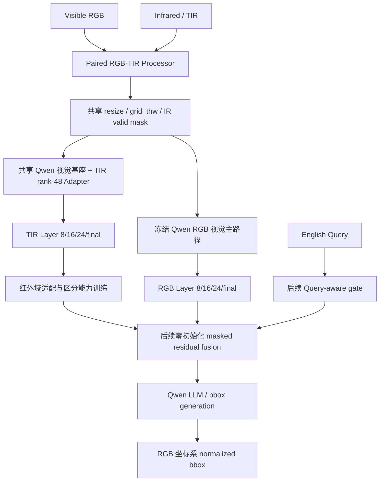
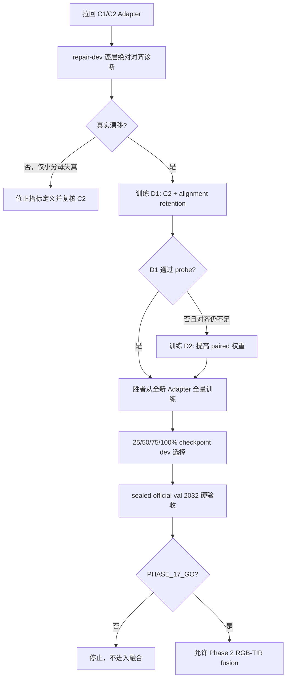

# AIC Qwen3-VL RGB–TIR 红外模块：完整方法、实验结果与下一步优化方案

> 文档日期：2026-08-13
> 用途：交给 ChatGPT 网页端或其他研究人员继续分析与制定后续实验。
> 当前结论：红外适配路线已证明可行，但现有 Adapter 尚未通过进入 RGB–TIR 融合阶段的硬门禁。下一步应先完成逐层对齐诊断与 Phase 1.7 定向修复，不能直接进入 Phase 2，也不能把当前结果描述为 AIC 平台提升。

---

## 1. 项目目标与当前边界

AIC 赛题输入为：

```text
Visible RGB + Infrared/TIR + Depth + English Query
                         ↓
输出 RGB 原始坐标系中的归一化 bbox [x1, y1, x2, y2]
```

当前最强的纯 RGB 平台记录包括：

- `Qwen3-VL-8B-Instruct` RGB-only：`ACC@0.5 = 0.7582`；
- `Qwen3-VL-30B-A3B-Instruct-FP8` 与历史稳定框补全组合：`ACC@0.5 = 0.7757`。

红外模块首先建立在 `Qwen3-VL-8B-Instruct BF16` 上，而不是直接修改 30B，原因是：

1. 8B 已有可信的 9,555/9,555 全量 RGB-only 控制结果；
2. 8B 更适合做可重复的适配、消融和全量验证；
3. 若先在 30B 上同时修改视觉主干、红外分支和融合层，一旦平台下降就无法归因；
4. 8B 路线验证成功后，Adapter/fusion 结构才迁移到 30B。

当前红外工作只处理 RGB–TIR。Depth 暂不进入训练，避免同时引入两种新模态和两套坐标/质量问题。

### 严格声明边界

目前已经验证的是：

- RGB/TIR 数据、坐标、黑边 mask 和 Qwen token grid 的工程正确性；
- TIR Adapter 能让红外目标区域与 RGB Teacher 表征更接近；
- 跨图负样本可以显著恢复红外特征的目标区分能力和有效秩；
- RGB 主路径可以保持冻结，IR 不可用时可退化为同一个模型的 RGB-only 路径。

目前还没有验证：

- Query 是否能从 RGB+TIR 中得到更好的目标定位；
- 最终生成 bbox 的 ACC@0.5 是否提高；
- AIC 平台分数是否超过 RGB-only；
- TIR 是否应在所有 Query、所有光照条件下启用；
- Depth 融合收益。

---

## 2. 为什么不能把红外图直接作为第二张图片输入 Qwen

Qwen3-VL 的视觉预训练以普通 RGB 为主。简单做：

```text
Prompt + RGB image + TIR image
```

存在以下问题：

1. 模型不一定知道第二张灰度图是热红外；
2. RGB 与 TIR 可能有黑边、视差、轻微倾斜或弱对齐；
3. TIR 缺少颜色、纹理和衣物花纹，不能替代 RGB；
4. 对 `checkered shirt`、颜色、文字等 Query，强行使用 TIR 可能产生负迁移；
5. 对低光人体、热目标、轮廓或遮挡，TIR 又可能是关键证据；
6. Qwen 的视觉信息不仅经过最终 merger，还通过 DeepStack 中间层注入语言模型，仅改最后一层会漏掉重要路径。

因此采用“共享 Qwen 视觉基座 + 模态专属低秩适配 + 掩码残差融合”的路线，而不是复制第二套完整 ViT。

---

## 3. 红外模块总体结构



### 3.1 Qwen 视觉层位置

使用真实 Qwen3-VL 视觉塔的 pre-merger 1152 维特征：

```text
Layer 8
Layer 16
Layer 24
Final
```

Layer 8/16 更偏底层和中层纹理、边缘、局部结构；Layer 24 更接近高级视觉语义；Final 已高度压缩和接近饱和，只作诊断，不单独决定 GO/NO-GO。

这里的 hook 是“在模型正常前向过程中读取指定层输出”，不修改 Transformers 安装文件，也不改变上游 Qwen 源码。

### 3.2 非对称模态适配

借鉴 RGBT-VGNet 的 AMA（Asymmetric Modality Adaptation）：

```text
RGB LoRA rank：0（当前完全冻结）
TIR LoRA rank：48
目标模块：每个视觉 block 的 attention qkv 与 proj
```

原因是 RGB 已经是 Qwen 的强项，TIR 与预训练域差异更大，需要更强的适配容量。当前 TIR Adapter：

- 108 个可训练张量；
- 8,957,952 个可训练参数；
- RGB 视觉主干和语言模型均冻结。

### 3.3 后续融合公式

Phase 2 计划使用严格零初始化残差：

```text
F_l = R_l + tanh(alpha_l) * g_l * M_l * A_l(T_l)
```

其中：

- `R_l`：RGB 第 l 层特征；
- `T_l`：TIR 第 l 层特征；
- `A_l`：TIR 投影/适配器；
- `M_l`：下采样到 token grid 的 IR 有效区域 mask；
- `g_l`：后续 Query、IR 质量和配准置信度共同产生的 gate；
- `alpha_l`：可学习标量，初始化为 0。

必须使用 `tanh(alpha_l)` 且令 `alpha_l=0`。若使用 `sigmoid(0)=0.5`，训练前就会把未经验证的 IR 注入 RGB 主路径，破坏 0.7582 控制基线。

---

## 4. 数据集与数据清理

训练和验证使用官方公开的 RGBT-GroundBench：

- grounding 实例：38,760；
- 唯一 RGB–TIR 图像对：21,535；
- 原始 train/val/test：26,604 / 2,032 / 10,124。

### 4.1 清洗规则

图片保持原位、只读，不修改像素。清洗只作用于训练 manifest：

- 排除 `negative_or_absent` 和 bbox 元信息污染等高风险语言记录；
- 检出并隔离 train/val 重复图像对；
- val/test 不因语言质量标记删样本，保持官方评测口径；
- 原始 Query 永久保留；低置信文本只标记，不擅自改写。

最终：

| 项目 | 数量 |
|---|---:|
| train all | 26,604 |
| train clean | 26,477 |
| excluded train | 127 |
| official val | 2,032 |
| official test | 10,124 |

检测到的跨 split 图像对：

```text
m3fd/02627.png
mfad/cali_l_2023_10_17_17_46_05_549.jpg
```

保留 val，排除对应 train 记录。

### 4.2 AIC 与 RGBT 的黑边和可用性

Phase 0 全量只读审计：

| 数据 | 图像对 | IR 黑边 | IR 可用 | RGB/TIR grid 一致 |
|---|---:|---:|---:|---:|
| RGBT-GroundBench | 21,535 | 4,056 | 21,534 | 21,535 |
| AIC | 2,000 | 1,439 | 1,998 | 2,000 |

AIC 中 IR 有效区域中位比例约为 `0.90644`。这说明黑边非常普遍，不能忽略。

处理方法：

1. RGB/TIR 使用同一 resize 几何；
2. 从外边界检测与边缘连通的近黑 padding；
3. 只屏蔽边缘连通黑边，不屏蔽内部真实暗目标；
4. 支持倾斜黑边；
5. mask 同步下采样到 patch 和 merged-token grid；
6. 最终 bbox 永远映射回 RGB 原始坐标系；
7. Phase 0 不对每张图自动做仿射配准，避免错误配准破坏数据。

### 4.3 图像归一化

- RGB 与 TIR 使用 Qwen 对应的图像标准化；
- 不做逐图 min-max，因为会改变跨样本热强度关系；
- RGB 与 TIR 必须共享 resize/grid，但 mask 与归一化分别处理；
- Depth 不参与当前阶段；AIC PNG uint16 深度与 JPG uint8 未知域必须分开，不能统一 `/255`。

---

## 5. Phase 0：工程骨架和等价性验证

状态：`PHASE_0_GO`。

完成内容：

- `src/aic_rgbtir/` 数据、processor、模型包装器与验证模块；
- clean manifests 和 500 条固定 tracer；
- bbox 坐标往返误差约 `1.14e-13` 像素；
- 500/500 processor 成功；
- RGB/TIR `grid_thw` 一致；
- 黑边 mask、patch mask 和 merged-token mask 正常；
- 未修改 Transformers 安装源码。

安全等价性：

| 检查 | 最大误差 |
|---|---:|
| FP32 gate=0 final | 0.0 |
| FP32 gate=0 DeepStack | 0.0 |
| BF16 gate=0 final | 0.0 |
| BF16 gate=0 DeepStack | 0.0 |
| `tir=None` vs RGB-only | 0.0 |

这证明包装器在红外关闭时不会污染 RGB-only 基线。

---

## 6. Phase 1：TIR rank-48 Adapter warmup

目标不是做最终融合，而是先让 Qwen 视觉塔“读懂红外目标区域”。

训练设置：

- 模型：`Qwen/Qwen3-VL-8B-Instruct`；
- revision：`0c351dd01ed87e9c1b53cbc748cba10e6187ff3b`；
- BF16；
- clean train：26,477/26,477；
- skipped/fallback：0；
- 只训练 TIR qkv/proj rank-48 Adapter；
- RGB 主路径哈希训练前后完全一致；
- 训练使用真实 bbox 生成 ROI mask，以对应 RGB ROI 作为冻结 Teacher。

损失的核心是：

```text
L = paired RGB–TIR alignment + same-image background margin
```

Phase 1 official-val-100 初步结果：

| 指标 | Base TIR | Adapted TIR |
|---|---:|---:|
| alignment loss | 0.152710 | 0.073343 |
| 相对改善 | — | 51.97% |

各层 paired cosine：

| 层 | 训练前 | 训练后 |
|---|---:|---:|
| Layer 8 | 0.71715 | 0.87767 |
| Layer 16 | 0.78759 | 0.90987 |
| Layer 24 | 0.95479 | 0.97669 |
| Final | 0.99539 | 0.99694 |

Phase 1 的阶段性结论：TIR Adapter 能显著改善配对目标区域的 RGB–TIR 对齐，但“配对 cosine 变高”不能证明不同目标仍可区分。

---

## 7. Phase 1.5：2,032 条 full-val 表征验收

状态：`PHASE_15_NO_GO`。

执行范围：

- official val：2,032/2,032；
- 唯一图像对：1,115/1,115；
- skipped：0；
- 全部权重冻结，无训练、无 Query、无融合、无 bbox 生成。

### 7.1 对齐和检索收益

总体 alignment loss：

```text
Base TIR    0.160773
Adapted TIR 0.070442
相对改善    56.19%
```

检索结果：

| 层 | R@1 Base → Adapted | R@5 Base → Adapted |
|---|---:|---:|
| Layer 8 | 26.08% → 50.39% | 44.00% → 70.03% |
| Layer 16 | 42.22% → 71.06% | 61.07% → 85.63% |
| Layer 24 | 33.81% → 65.01% | 53.79% → 83.61% |
| Final | 23.97% → 46.90% | 40.50% → 64.27% |

### 7.2 低秩坍缩

有效秩：

| 层 | Base TIR | Adapted TIR | RGB Teacher |
|---|---:|---:|---:|
| Layer 8 | 99.45 | 30.39 | 102.72 |
| Layer 16 | 77.42 | 22.72 | 65.65 |
| Layer 24 | 59.87 | 22.94 | 57.82 |
| Final | 1.02 | 1.02 | 1.01 |

尽管检索大幅提高，Layer 8/16/24 的有效秩严重下降，同时 Layer 16 的非配对 cosine P95 增量超过 0.10。

这表示：

```text
正确 RGB–TIR 配对变得更相似
但大量不同目标也被压缩到较接近的特征子空间
```

因此 Phase 1 Adapter 不能直接进入融合，否则可能在最终定位时把主体、参照物、部件或不同实例混淆。

---

## 8. Phase 1.6：去坍缩修复实验

状态：`PHASE_16_NO_GO`。这里的 NO_GO 是预设硬门禁未全部满足，不是程序崩溃。

### 8.1 数据隔离

```text
repair_probe_train：4,096 个独立图像对
repair_dev：1,024 个独立图像对
repair_full_train：24,612 条记录 / 13,822 对
official val：2,032 条 / 1,115 对（本轮因 probe NO_GO 未打开）
```

probe/dev/full/official val 图像对完全隔离。

共同 Teacher Bank：

- 15,961 个唯一图像对；
- 27,668 条记录；
- fingerprint：`27F807D602F84D7E8420C49A4B60A44104BD379F6376178D7DC1CD4220CF87E6`。

每条 TIR 样本固定使用 256 个跨图 RGB 负例：128 个同来源、64 个同条件、64 个全局随机；禁止同一图像对。

### 8.2 三条候选支线

| 候选 | 损失权重 | 验证假设 |
|---|---|---|
| C0 | paired 1.0 + background 0.25 | 旧对齐路线能否独立修复坍缩 |
| C1 | paired 0.25 + InfoNCE 1.0 + background 0.10 | 跨图负样本是否是去坍缩关键 |
| C2 | C1 + relational distillation 0.50 | 是否还能保留 RGB Teacher 的目标关系结构 |

三条支线均从完全相同的全新 rank-48 Adapter 初始化，互不继承权重，分别训练 4,096 步并在相同 repair-dev 上评价。

### 8.3 实测结果

| 指标 | Base TIR | C0 | C1 | C2 |
|---|---:|---:|---:|---:|
| 平均 R@5 | 60.45% | 69.50% | 82.39% | **83.56%** |
| 平均 R@1 | — | 48.93% | 57.65% | **60.03%** |
| 最低有效秩/Base | — | 36.63% | 89.29% | **89.77%** |
| 最低有效秩/RGB Teacher | — | 37.83% | 81.47% | **81.90%** |
| paired-shuffled margin | — | 0.0557 | **0.1800** | 0.1698 |
| 非配对 cosine P95 最大增量 | — | +0.1078 | -0.2571 | -0.2023 |
| 最差层相对 alignment improvement | — | +36.94% | -1476.50% | -955.24% |
| 硬门禁 | — | FAIL | FAIL | FAIL |

### 8.4 结果解释

#### C0

C0 仍有严重低秩坍缩：有效秩相对 Base/RGB 仅约 37%，且非配对 cosine P95 超标。旧损失路线被否定。

#### C1

C1 将平均 R@5 提高到 82.39%，有效秩恢复到 Base 的 89.29%、RGB Teacher 的 81.47%，并显著降低非配对相似度。这强烈支持：跨图 InfoNCE 是去坍缩的关键。

#### C2

C2 综合最好：R@1、R@5 和有效秩均略高于 C1。关系蒸馏有正向贡献，C2 是下一步最值得继续的主线。

#### 为什么 C1/C2 仍然 NO_GO

它们卡在 `minimum_alignment_improvement >= 2%`。当前实现对 Layer 8/16/24 分别计算：

```text
(Base alignment loss - Adapted alignment loss) / Base alignment loss
```

然后取最差一层。如果某层 Base alignment loss 很小，轻微绝对变化会被很小的分母放大成巨大负百分比。也可能确实存在某一层绝对 paired cosine 明显下降。

现有 summary 只保存聚合最小值，尚不足以区分：

1. 真正的单层对齐漂移；
2. 相对比率因小分母造成的数值放大。

所以不能直接放宽门禁，也不能宣布 C2 成功。

---

## 9. 硬门禁的意义

硬门禁是预先登记的最低安全条件，使用 AND 逻辑；任何一项失败都不得进入全量训练。

当前 probe 门禁包括：

1. 最差层 alignment 至少改善 2%；
2. R@5 不能明显下降；
3. 至少一层检索提升 1 个百分点；
4. 最低有效秩/Base ≥70%；
5. 最低有效秩/RGB Teacher ≥50%；
6. 非配对 cosine P95 增量 ≤0.10；
7. paired-shuffled margin >0。

“最低有效秩/Base”是：

```text
Adapted TIR effective rank / Base TIR effective rank
```

衡量 Adapter 相对训练前红外表征保留多少容量。

“最低有效秩/RGB Teacher”是：

```text
Adapted TIR effective rank / RGB Teacher effective rank
```

衡量红外分支相对成熟 RGB 表征具有多少表达容量。两项都取 Layer 8/16/24 的最差值，防止平均数掩盖某一层坍缩。

---

## 10. 当前已推翻和保留的方向

### 已推翻或暂停

1. **只用配对 cosine/alignment 训练红外 Adapter**：会显著提高对齐和检索，但可造成低秩坍缩。
2. **直接把 Phase 1 Adapter 接入 RGB 融合**：Phase 1.5 已证明不安全。
3. **只看 final 层**：Final 本身有效秩约 1，接近饱和，不能代表中层目标区分能力。
4. **所有样本无条件注入 TIR**：颜色、纹理、OCR、衣物图案等 Query 可能被红外干扰。
5. **简单复制一套完整第二 ViT**：成本高、难归因，现阶段无必要。
6. **同时加入 TIR、Depth、Query gate、配准和 bbox head**：会失去单变量归因能力。
7. **直接扩大到 30B**：8B 的红外表征问题尚未解决，扩大底座不会自动消除坍缩或错配。

### 得到支持

1. 非对称适配（RGB 冻结、TIR rank-48）工程可行；
2. Layer 8/16/24 多层适配比只改 final 更合理；
3. 边缘连通黑边 mask 与共享 grid 链路可靠；
4. 跨图 InfoNCE 是修复坍缩的核心；
5. relational distillation 对 R@1/R@5 和有效秩有小幅增益；
6. C2 是下一阶段基础，但必须补上绝对对齐保护。

---

## 11. 下一步：Phase 1.7 逐层诊断与受约束修复

### 11.1 目标

回答两个问题：

1. C1/C2 的 alignment 失败是真实漂移，还是相对百分比的小分母失真？
2. 如何保留 C2 的高检索、高有效秩，同时避免任何主要层的绝对配对对齐明显退化？

### 11.2 Phase 1.7A：只诊断，不训练

首先保留并拉回云端 C1/C2 Adapter、summary、fingerprint。使用固定 repair-dev 重新输出每层指标：

```text
base/adapted paired cosine mean/median/P5/P95
base/adapted alignment loss
alignment absolute delta
alignment relative ratio及其分母
R@1 / R@5
effective rank / participation ratio
nonpaired cosine mean/P95
paired-shuffled margin及bootstrap 95% CI
```

同时输出最差 100 条记录及分组：source、光照、天气、小目标、遮挡、黑边、弱配准风险和 ROI token 数。

诊断门槛：

- 若巨大负比率对应的绝对 paired cosine 下降 ≤0.01，判定为指标数值不稳；
- 若任一主要层平均 cosine 下降 >0.02，或某主要分组下降 >0.05，判定为真实对齐漂移；
- 不根据 official val 调参，仍只使用 repair-dev。

这一步在本机 4060 可做；无需租 4090，前提是已拉回 C1/C2 Adapter。

### 11.3 Phase 1.7B：两条定向候选

不再重跑已经失败的 C0。保留 C2 作为缓存控制结果，新增：

#### D1：C2 + Base-relative alignment retention（推荐主线）

新增每层对齐保留铰链：

```text
L_retain,l = ReLU(cos_base,l - epsilon_l - cos_adapted,l)
```

其含义不是强迫 TIR 与 RGB 完全相同，而是规定：Adapted TIR 的配对 cosine 不得低于 Base TIR 太多。

建议初值：

```text
epsilon_8  = 0.02
epsilon_16 = 0.02
epsilon_24 = 0.01
Final 仅诊断，不施加强约束
```

总损失：

```text
0.25 * paired alignment
+ 1.00 * InfoNCE
+ 0.50 * relational distillation
+ 0.10 * background margin
+ 0.50 * alignment retention hinge
```

#### D2：D1 + 较强 paired 权重

将 paired alignment 从 0.25 提高至 0.50，其他同 D1。它用于判断 C2 的失败是否只是 InfoNCE/paired 权重失衡。

只有 D1 仍出现真实对齐漂移时才训练 D2；不要无条件把两条都跑到底。

### 11.4 改进后的门禁

不应简单删除 alignment 门禁，而应从不稳定的“最差层相对百分比”改为：

1. Layer 8/16/24 的 adapted paired cosine 均不得低于 base 超过预注册绝对容差；
2. 加权平均 alignment loss 不得比 base 恶化超过 2%；
3. 平均 R@5 相对 Base 至少提升 10 个百分点；
4. 每层 R@5 不下降超过 0.5 个百分点；
5. 有效秩/Base ≥70%；
6. 有效秩/RGB Teacher ≥50%；
7. 非配对 cosine P95 增量 ≤0.10；
8. paired-shuffled margin 的 bootstrap 95% 下界 >0；
9. 所有输出有限，RGB base 哈希不变，无第二模型 fallback。

门禁阈值必须在重新训练前登记，不能看到结果后反向修改。

### 11.5 训练与验证顺序



### 11.6 资源建议

- Phase 1.7A：本机 RTX 4060 8GB，预计以 1,024 条 dev 推理为主；
- D1/D2 probe 与 full train：RTX 4090 24GB；
- 复用现有 Teacher Bank fingerprint，避免再次构建 15,961 对缓存；
- 若 fingerprint、模型 revision、processor 或 manifest 改变，禁止复用旧 Teacher Bank。

---

## 12. Phase 2：Query-aware RGB–TIR 融合计划

仅在 Phase 1.7 最终 GO 后启动。

### 12.1 第一轮只训练 fusion/gate

冻结：

```text
Qwen RGB vision
Qwen LLM
已通过验收的 TIR Adapter
```

只训练：

```text
Layer 8/16/24/final 的 TIR projection
zero-init residual scale alpha
Query-aware / IR-quality / alignment-confidence gate
```

### 12.2 Gate 输入

Gate 不能只看图像质量，还应同时看 Query：

- Query 语义：颜色/纹理/OCR/衣物图案倾向 RGB；人体热源、夜间轮廓倾向 TIR；
- IR 质量：有效区域比例、熵、对比度、黑边比例；
- 配准置信度：RGB/TIR 边缘或局部结构一致性；
- 层级：Layer 8/16/24 可以获得不同权重；
- modality dropout：训练时随机关闭 TIR，确保 RGB 路径不依赖红外。

### 12.3 必做对照

使用完全相同输入分辨率、prompt 和 bbox 解析：

```text
A. RGB-only（冻结控制）
B. TIR-only（诊断，不作为最终方案）
C. RGB+TIR，静态小 gate
D. RGB+TIR，Query-aware gate
E. D + IR quality gate
F. E + alignment confidence gate
```

每次只新增一个变量。必须报告总体和以下分组：低光、普通光、小目标、遮挡、黑边、弱配准、颜色/纹理 Query、热目标 Query。

### 12.4 输出与损失

第一版继续保留 Qwen 原生生成式 bbox 输出，以便和 0.7582 RGB-only 公平比较。训练可采用：

```text
Query-to-bbox SFT
+ normalized bbox L1
+ GIoU/DIoU（若直接 bbox head 已可靠接入）
+ modality dropout consistency
+ RGB degradation guard
```

不要在第一轮同时引入独立 bbox head 和生成式 bbox 双输出；先选择一个主输出，减少归因混乱。

### 12.5 AIC 平台判定

平台只做单变量提交：

```text
S_RGB = Qwen3-VL-8B RGB-only 0.7582
S_TIR = 同一 8B + 已验收 RGB-TIR fusion
```

建议实质提升阈值：

```text
S_TIR >= 0.7632
```

即至少提高 0.5 个百分点，同时：

- 非法 bbox = 0；
- 不使用第二模型补框；
- TIR 不可用时由同一模型 RGB-only 退化；
- 记录 gate 分布和 RGB-only 回退比例。

若 8B 融合稳定提升，再迁移到 30B，而不是重新设计另一套红外模块。

---

## 13. 弱配准与 CoDAF 的进入条件

当前 processor 只解决共享几何和黑边有效区域，不声称 RGB/TIR 像素严格对齐。

只有当 Phase 2 分组结果显示：

```text
整体融合有效
但 weak-alignment / tilted-border 子集显著落后
```

才引入 CoDAF 式弱对齐模块，例如局部 deformable alignment、offset-aware cross attention 或对齐置信度衰减。

不应在 Phase 1.7 同时加入 CoDAF，因为那会把“红外表征修复”和“几何对齐修复”混在一起。

---

## 14. Depth 的后续顺序

Depth 在 RGB–TIR 稳定之前保持独立。建议顺序：

```text
RGB-only strong baseline
→ TIR Adapter 去坍缩
→ Query-aware RGB-TIR fusion
→ AIC 平台证明增益
→ Depth-only 质量/关系验证
→ Depth late fusion
```

Depth 优先服务明确的：

```text
nearest / farthest / closer / farther / front / behind
```

AIC PNG uint16 Depth 可解释为毫米；97 个 JPG uint8 三通道 Depth 只能作为未知相对强度域，不能解释成毫米。

---

## 15. 当前最推荐的下一轮操作

按优先级：

1. 保存云端 C1/C2 Adapter、summary、Teacher Bank fingerprint 和完整日志；
2. 暂不继续付费训练，先在本地实现逐层绝对对齐指标与单元测试；
3. 本机 4060 对 repair-dev 运行 Phase 1.7A；
4. 判断 C2 是真实对齐漂移还是相对指标失真；
5. 若真实漂移，实施 D1；只有 D1 不足才实施 D2；
6. D1/D2 胜者重新全量训练，并用 sealed official val 验收；
7. 只有 `PHASE_17_GO` 后进入 Query-aware fusion；
8. 8B 平台超过 0.7632 后，再迁移至 30B；
9. RGB–TIR 稳定后再加入 Depth。

### 当前技术判断

最值得保留的是 C2 的结构：

```text
InfoNCE
+ relational distillation
+ background margin
+ 适量 paired alignment
```

最需要补足的是：

```text
逐层绝对对齐可观测性
+ Base-relative alignment retention
+ 更稳定的预注册门禁
```

不建议回到 C0，也不建议仅仅把现有 alignment 门禁删除后强行全量训练 C2。

---

## 16. 关键本地证据与代码位置

工程根目录：

```text
D:/12525/Documents/pytorch/baseline_v0
```

核心代码：

```text
src/aic_rgbtir/data.py
src/aic_rgbtir/processing.py
src/aic_rgbtir/modeling.py
src/aic_rgbtir/validation.py
src/aic_rgbtir/phase1.py
src/aic_rgbtir/phase15.py
src/aic_rgbtir/phase16.py
tools/run_rgbtir_phase0.py
tools/run_rgbtir_phase1.py
tools/run_rgbtir_phase15.py
tools/run_rgbtir_phase16.py
```

主要本地报告：

```text
reports/aic_rgbtir_phase0_readiness_2026_08_12.md
reports/aic_rgbtir_phase1_result_analysis_2026_08_12.md
reports/aic_rgbtir_phase15_full_validation_2026_08_12.md
reports/aic_rgbtir_phase16_cloud_runbook_2026_08_13.md
reports/aic_rgbtir_phase16_prerental_readiness_2026_08_13.md
```

主要本地输出：

```text
outputs/aic_rgbtir_phase0_v1/
outputs/aic_rgbtir_phase1_release_20260812/
outputs/aic_rgbtir_phase15_v1/
outputs/aic_rgbtir_phase16_v1/
```

Phase 1.6 云端输出：

```text
/home/featurize/aic_cloud/outputs/aic_rgbtir_phase16_v1/
```

Phase 1.6 云端主日志：

```text
/home/featurize/aic_cloud/logs/aic_rgbtir_phase16_v1/03_phase16_all.log
```

---

## 17. 给后续分析者的三个核心问题

1. C1/C2 的最差层相对 alignment improvement 为巨大负数，究竟是哪个层、多少绝对 cosine 差值、是否由小分母放大？
2. 在不牺牲 C2 的 R@5=83.56% 和有效秩约 90% 的前提下，Base-relative alignment retention 应采用多大容差和权重？
3. Phase 2 的 Query-aware gate 如何在颜色/纹理/OCR Query 中保护 RGB，同时在低光、热目标和遮挡场景中选择性利用 TIR？

这些问题解决后，才真正具备在 AIC 平台上验证红外带来实质收益的条件。
