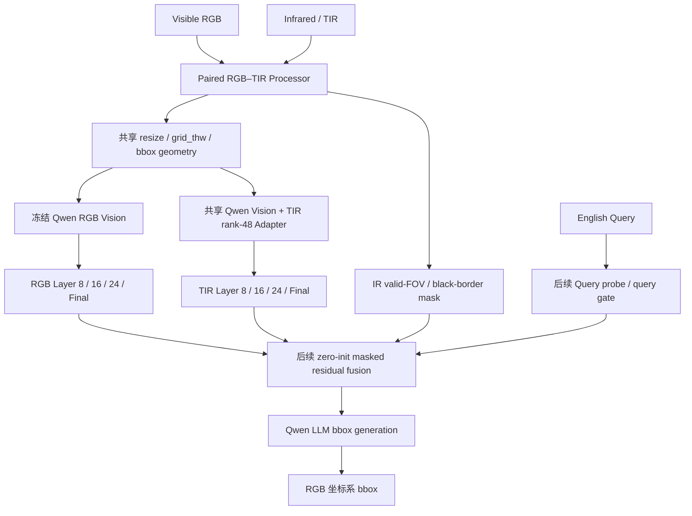
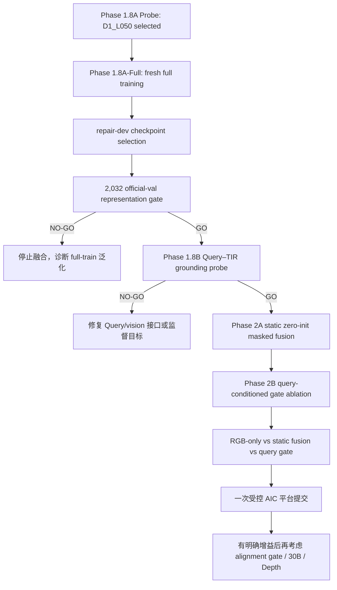

# AIC RGB–TIR 红外模块当前状态、Query 验证与下一阶段路线

> 文档用途：提供给 ChatGPT 网页端或项目成员进行独立复核。
> 更新时间：2026-08-14（Asia/Shanghai）
> 当前基座：`Qwen/Qwen3-VL-8B-Instruct`
> 当前阶段：Phase 1.8A D1 Retention Probe 已完成
> 当前候选：`D1_L050`
> 重要边界：本文中的表征检索指标不是 AIC ACC@0.5，也不是最终 bbox 定位结果。

---

## 1. 一句话结论

当前红外路线已经从“红外特征向 RGB 对齐但发生低秩坍缩”，推进到“在保持跨实例区分能力的同时，显著降低红外特征相对 RGB 共享语义的逐层漂移”。Phase 1.8A 的 `D1_L050` 通过全部预注册门禁，是下一次完整训练的唯一候选。

但是，当前实验仍然没有使用 Query、没有生成 bbox、没有做 RGB–TIR 融合、没有执行 2,032 条 official val，也没有在 AIC 平台测试。因此下一步不是直接提交比赛，而是：

1. 固定 `D1_L050` 做全量训练和 official-val 表征验收；
2. 使用 RGBT-GroundBench 的 Query+bbox 做冻结式 Query–TIR grounding 验证；
3. 只有 Query 验证通过，才接入最小零初始化 RGB–TIR 残差融合；
4. Query-aware gate 作为相对静态融合的单变量增量实验；
5. 最后才进行一次受控 AIC 平台提交，Depth 和 30B 继续推迟。

---

## 2. 任务目标与控制基线

AIC 任务输入为：

```text
Visible RGB + Infrared/TIR + Depth + English Query
```

输出为目标在原始 RGB 图像坐标系中的归一化边界框：

```text
[x1, y1, x2, y2]
```

当前研究只覆盖：

```text
RGB + TIR + Query → RGB-coordinate bbox
```

Depth 暂缓，避免同时引入第三模态、PNG uint16 毫米深度、JPG uint8 未知深度域和额外坐标映射，使实验无法归因。

### 2.1 已确认的 RGB-only 控制结果

| 模型 | 输入 | AIC ACC@0.5 | 定位 |
|---|---|---:|---|
| Qwen3-VL-8B-Instruct | RGB + Query | 0.7582 | 当前红外路线的干净控制基线 |
| Qwen3-VL-30B-A3B-Instruct-FP8 + 8B 补框 | RGB + Query | 0.7757 | 历史最高参考，但包含第二模型补框，不是当前红外模块的干净控制 |

红外模块优先在 8B 上开发。原因是 8B 基线稳定、成本低、已有完整推理链路，并能把增益归因到红外模块；未经 8B 证明的结构不应直接迁移到 30B。

---

## 3. 当前算法结构

本路线不复制第二套完整视觉大模型，而是在共享 Qwen3-VL 视觉塔上增加 TIR 专用 rank-48 Adapter：



固定安全属性：

- RGB 主路径、LLM 和基础视觉权重冻结；
- RGB Adapter rank 为 0，TIR Adapter rank 为 48；
- TIR LoRA 只覆盖视觉注意力 `qkv` 与 `proj`；
- RGB/TIR 使用相同几何变换和 `grid_thw`；
- 红外黑边通过与外边界连接的近黑区域生成有效视场 mask；
- bbox 始终映射回原始 RGB 坐标系；
- `tir=None`、IR 无效或融合系数为 0 时，同一模型退化为 RGB-only；
- 不允许使用第二模型替代红外失败样本。

---

## 4. 数据、切分和域风险

### 4.1 RGBT-GroundBench

| 项目 | 数量 |
|---|---:|
| 原始 grounding 实例 | 38,760 |
| 唯一 RGB/TIR 图像对 | 21,535 |
| official train | 26,604 |
| clean train | 26,477 |
| official val | 2,032 |
| official test | 10,124 |

训练集清理排除了 127 条高风险记录，包括负样本/缺失目标语言、bbox 元数据语言和两个 train/val 重叠图像对对应的 train 记录。official val/test 不因语言质量标志删样本，以保留官方评测口径。

### 4.2 Phase 1.6–1.8 固定切分

| 切分 | 记录数 | 唯一图像对 | 用途 |
|---|---:|---:|---|
| repair probe train | 4,096 | 4,096 | 候选损失与 retention 强度选择 |
| repair dev | 1,024 | 1,024 | 候选选择、禁止 official-val 调参 |
| repair full train | 24,612 | 13,822 | 下一轮完整训练 |
| official val | 2,032 | 1,115 | 最终一次外部验证 |

所有切分按图像对隔离，train/dev/official-val 重叠为 0。

### 4.3 AIC 与训练域的差异

RGBT-GroundBench 与 AIC 的任务形式高度接近，但不等同：

- AIC 的 Query 更长，空间关系、序数、区域和建筑部件更多；
- AIC 存在大量小目标以及明显的红外黑边、倾斜有效视场和弱配准风险；
- RGBT-GroundBench 更偏道路参与者、低光和常规热目标；
- external official-val 通过不等于 AIC 平台一定增分。

AIC 测试 Query 可以用于只读分布画像，但没有 GT，不能用于训练、checkpoint 选择或门控阈值拟合。

---

## 5. 从 Phase 0 到 Phase 1.8 的演进

| 阶段 | 状态 | 完成内容 | 核心结论 |
|---|---|---|---|
| Phase 0 | `PHASE_0_GO` | manifest、同步 processor、mask、grid、坐标链路、gate=0 等价性 | 工程链路可信，初始状态严格等于 RGB-only |
| Phase 1 | 完成 | 只训练 TIR rank-48 Adapter，26,477/26,477 | 对齐 loss 改善，但未证明实例区分能力 |
| Phase 1.5 | `NO_GO` | 2,032 official val 的检索与坍缩检查 | R@1/R@5 提升，但 Layer 8/16/24 严重低秩坍缩 |
| Phase 1.6 | probe `NO_GO` | C0/C1/C2 去坍缩候选 | InfoNCE 恢复区分度，C2 最好，但中层对齐发生漂移 |
| Phase 1.7A+ | 完成 | 1,024 repair-dev 逐层漂移、质量和假负例审计 | 漂移是真实全局结构冲突，唯一支持分支为 D1 retention |
| Phase 1.8A | `PHASE_18_D1_GO` | λ=0.10/0.25/0.50 单变量 probe | `D1_L050` 同时满足漂移、检索、有效秩和安全门禁 |

---

## 6. 前几轮为什么失败

### 6.1 Phase 1：对齐很好，但表征坍缩

Phase 1 只优化正确 RGB–TIR ROI 配对，没有跨图负例。模型可以通过把不同目标压缩到相似子空间来降低 paired loss。

结果是检索变好，但有效秩大幅下降：

| 层 | Base effective rank | Phase 1 Adapted effective rank |
|---|---:|---:|
| Layer 8 | 99.45 | 30.39 |
| Layer 16 | 77.42 | 22.72 |
| Layer 24 | 59.87 | 22.94 |

因此“paired cosine 更高”不能单独作为红外适配成功的证据。

### 6.2 Phase 1.6：去坍缩成功，但共享语义漂移

C2 使用：

```text
paired alignment
+ cross-image InfoNCE
+ relational distillation
+ background margin
```

它恢复了有效秩与跨实例检索，但 Layer 8/16/24 相对 Base TIR→RGB Teacher 的共享语义发生明显漂移：

| 层 | C2 绝对漂移 |
|---|---:|
| Layer 8 | 0.12893 |
| Layer 16 | 0.15261 |
| Layer 24 | 0.38376 |

问题本质是：判别约束把不同目标分开了，但也过度拉开了 RGB/TIR 的共享目标语义。

---

## 7. Phase 1.8A D1 Retention Probe

### 7.1 唯一变化

保持 C2 的训练结构，新增逐层 Base-relative retention：

\[
L_{retain,l}=\operatorname{ReLU}
\left(\cos(T^{base}_l,R_l)-\epsilon_l-\cos(T^{adapt}_l,R_l)\right)
\]

容差：

```text
epsilon_8  = 0.02
epsilon_16 = 0.02
epsilon_24 = 0.01
Final      = 仅诊断
```

三个候选除 retention 权重外完全一致：

```text
D1_L010: λ = 0.10
D1_L025: λ = 0.25
D1_L050: λ = 0.50
```

固定项包括：rank-48 全新初始化、4,096 probe train、1,024 repair dev、Teacher Bank、256 个负例、seed `20260812`、AdamW、学习率、步数和 processor。

### 7.2 最终结果

| 指标 | D1_L010 | D1_L025 | D1_L050 |
|---|---:|---:|---:|
| Gate | FAIL | PASS | **PASS / selected** |
| 平均 R@1 | 60.09% | 60.74% | **61.52%** |
| 平均 R@5 | 83.59% | 83.76% | **84.38%** |
| Layer 8 drift | 0.11776 | 0.10246 | **0.08302** |
| Layer 16 drift | 0.14044 | 0.12419 | **0.10177** |
| Layer 24 drift | 0.34098 | 0.28707 | **0.21814** |
| Layer 24 drift reduction vs C2 | 11.15% | 25.19% | **43.16%** |
| 最低有效秩/Base TIR | 89.42% | 88.79% | **88.24%** |
| 最低有效秩/RGB Teacher | 81.58% | 81.01% | **80.50%** |
| 最低 paired-shuffled margin | 0.1664 | 0.1608 | **0.1516** |

`D1_L050` 的 retention 更强，有效秩和 margin 比较弱的 retention 略低，但仍显著高于硬门禁；同时它的 R@1/R@5 最高、三层漂移最低，形成当前最好的综合平衡。

### 7.3 安全结果

- 三条候选全部完成；
- RGB/base 参数训练前后 SHA-256 一致；
- safety equivalence：`PASS`；
- 无 full training；
- 无 official val；
- 无 Query、bbox、AIC 测试；
- 无第二模型 fallback。

### 7.4 D1_L050 证明了什么

已证明：

- retention 约束可以显著降低 Layer 8/16/24 漂移；
- 检索性能没有因为 retention 下降，反而在 probe 中略有提高；
- 有效秩仍保持健康；
- RGB 主路径没有被修改；
- `D1_L050` 值得进入完整训练。

没有证明：

- Query 能正确读取和利用 D1 特征；
- D1 能改善自然语言 grounding；
- RGB+TIR 融合能够减少 bbox 错误；
- AIC ACC@0.5 会提升；
- 低光、热目标或小目标一定被救回。

---

## 8. 是否需要引入 Query

### 8.1 结论

需要，而且是下一阶段不可缺少的验证变量。但 Query 不应立刻混入 D1 全量训练，也不应与正式融合、质量门控和 bbox 微调在同一轮同时加入。

当前 R@1/R@5 的正确项是“同一记录的 TIR ROI 是否能检索到 RGB ROI”。它验证的是跨模态实例身份与表征结构，不验证：

> 给定一句自然语言描述，模型是否能在多个目标中选择描述对应的目标。

这两者不是同一个问题。模型可能非常擅长配对 RGB/TIR，却无法理解 `leftmost camera`、`man in a checkered shirt`、`farthest drone` 或区域结构 Query。

### 8.2 Query 应分两步进入

#### 第一步：Query 作为验证信号

在完整 D1 Adapter 训练和 official-val 表征验收后，冻结 Qwen 基座和 D1 Adapter，使用 RGBT-GroundBench 的 Query+bbox 做 Query–TIR grounding probe。

至少比较：

```text
Q0: RGB-only + Query
Q1: Base TIR + Query
Q2: C2 TIR + Query
Q3: D1_L050 TIR + Query
```

执行两个互补评测：

1. **候选级 Query–ROI 排序**
   每条 Query 使用 GT ROI、同图其他目标、主体/参照物和几何扰动框组成候选集，统计 Top-1、MRR、正负 margin。
2. **TIR-only 端到端 bbox grounding**
   使用固定 prompt、生成参数、解析器和坐标逆变换，在 official val 统计 ACC@0.5、mean IoU、invalid bbox rate。

候选排序用于定位语言/视觉语义问题，端到端 bbox 用于判断这些表征是否真正到达 Qwen 的定位输出。

#### 第二步：Query 作为融合门控

只有 Query probe 证明 D1 特征能服务自然语言定位后，才把 Query 编码加入 RGB–TIR 融合 gate。

Query gate 的作用不是“根据关键词强制使用红外”，而是学习：

- 颜色、纹理、服饰、OCR Query 通常应更信任 RGB；
- 人、车、动物、热轮廓、弱光目标可能从 TIR 受益；
- 空间关系、序数和区域 Query 需要保留全局 RGB 几何，TIR 只能提供可见性辅助；
- IR 黑边、低有效视场和弱配准时，应让 TIR contribution 接近 0。

### 8.3 AIC Query 可以怎样使用

允许：

- 只读统计 Query 长度、类别、空间词、序数、属性、区域和热相关实体；
- 检查 RGBT 训练 Query 对 AIC Query 类型的覆盖度；
- 在最终无标签 dry-run 中统计门控分布、非法框率和模型分歧。

禁止：

- 使用 AIC Query 或模型预测训练 Adapter/gate；
- 根据 AIC Query ID 写特判；
- 用无 GT 的 AIC 结果选择 checkpoint 或门控阈值；
- 把 AIC 预测框当成真实目标尺寸。

---

## 9. 下一阶段严格执行路线



### 9.1 Phase 1.8A-Full：现在最优先

固定：

- 候选：`D1_L050`；
- 从与 probe 相同的全新 rank-48 初始化开始，不把 probe checkpoint 直接当 full-train 起点；
- full train：24,612 条、13,822 图像对；
- 只训练 TIR Adapter；
- RGB/LLM/基础视觉权重冻结；
- 在 25%/50%/75%/100% 保存 checkpoint；
- 只根据 repair-dev 预注册综合指标选 checkpoint；
- official val 只在方案和 checkpoint 冻结后打开一次。

完整训练门禁至少包括：

1. full train 全部完成、skipped=0、无 NaN/Inf；
2. RGB base hash 不变；
3. Layer 8/16/24 drift 均低于 C2；
4. Layer 24 drift 相对 C2 至少降低 25%；
5. R@1/R@5 不低于预注册保留阈值；
6. effective rank/Base TIR ≥85%；
7. effective rank/RGB Teacher ≥75%；
8. paired-shuffled margin >0；
9. nonpaired cosine P95 增量 ≤0.10；
10. 主要 source/illumination/weather/size/occlusion 分组不得出现明显系统性恶化；
11. 不存在第二模型 fallback。

### 9.2 Phase 1.8B：Query–TIR Grounding Probe

目标：证明 D1 学到的不是只能做配对检索的表征，而是能被自然语言定位链路使用。

建议输出：

```text
query_roi_ranking.json
tir_grounding_predictions.jsonl
query_type_metrics.csv
query_tir_probe_summary.json
safety_equivalence.json
```

分组至少包括：

- simple entity；
- attribute/color/clothing；
- action；
- spatial relation；
- ordinal/count；
- plural/group；
- small object；
- low light；
- occlusion；
- source dataset。

进入融合的建议门禁：

- invalid bbox=0、fallback=0；
- D1 TIR 的 candidate Top-1/MRR 明显优于 Base TIR；
- D1 TIR 的端到端 ACC@0.5 不低于 Base TIR，并在低光/热目标相关分组存在稳定增益；
- 颜色/OCR/普通光照分组不得出现明显系统性伤害；
- bootstrap 或按图像对重采样后，关键差异方向稳定。

### 9.3 Phase 2：最小融合，仍坚持单变量

先做静态融合控制：

\[
F_l=R_l+\tanh(\alpha_l)\,M_l\,g_l^{static}\,P_l(T_l)
\]

其中 `alpha_l=0` 初始化，保证第一步严格等于 RGB-only。

再单独增加 Query gate：

\[
F_l=R_l+\tanh(\alpha_l)\,M_l\,g_l(q,quality)\,P_l(T_l)
\]

对照必须保持：

```text
F0: RGB-only
F1: RGB + TIR static masked residual
F2: F1 + Query-conditioned gate
```

只有 `F2-F1` 才能归因于 Query gate；只有 `F1-F0` 才能归因于红外融合本身。

---

## 10. 当前不应执行的方向

在 D1 full train、official val 和 Query probe 通过前，不应：

- 直接全量训练 Shared/Complementary 双分支；
- 同时加入 Query gate、质量 gate、alignment gate 和 bbox head；
- 使用 AIC 测试预测作为伪标签；
- 把配对检索提升写成 grounding 或平台提升；
- 迁移到 30B 做昂贵训练；
- 加入 Depth；
- 用另一个模型补红外失败样本；
- 因为个别黑边或弱配准样本就提前加入复杂配准网络。

弱配准模块只能在融合后出现清晰、可复现的 weak-alignment Harm 时再作为单变量验证。

---

## 11. 当前路线的整体评价

### 优点

- 保护了已经达到 0.7582 的 RGB-only 基线；
- 数据、坐标、mask、grid 和模型 hook 均有工程验收；
- 用 effective rank 和非配对相似度发现了 paired loss 无法发现的坍缩；
- 使用 InfoNCE 和 relational distillation 恢复了区分能力；
- 使用 D1 retention 解决了去坍缩后的中层语义漂移；
- 每轮只改变一个变量，因果边界清晰；
- 所有云端 Adapter、摘要、日志和哈希已回传本地。

### 当前短板

- D1 只在 4,096/1,024 probe/dev 上验证，尚未 full-train 泛化；
- 当前检索任务不包含自然语言；
- 还没有端到端 bbox grounding 证据；
- 还没有 RGB+TIR 融合结果；
- AIC 的黑边、弱配准、区域目标和长 Query 分布仍可能造成域偏移；
- 目前不能声称红外模块已经提高比赛成绩。

### 最关键判断

当前路线没有失败，也还没有完成。它已经解决“红外 Adapter 是否学坏”的主要表征问题，下一道真正的门槛是：

> D1_L050 学到的健康红外表征，能否被 Query 驱动的定位链路使用，并在不伤害 RGB-only 的情况下产生可拒绝、可归因的增量信息。

---

## 12. 复现资产

| 资产 | 标识或位置 |
|---|---|
| Qwen3-VL-8B revision | `0c351dd01ed87e9c1b53cbc748cba10e6187ff3b` |
| Teacher Bank fingerprint | `79CF814B64EC640AD3D924342FEEED235764F139445F834B2CDB2DD0B580C05C` |
| Phase 1.8 本地归档 SHA-256 | `5f6b57b2e662e5b1ebe2457c11c6e2d5103c260a4d568dd6589316e50426059d` |
| Phase 1.8 归档目录 | `outputs/aic_rgbtir_phase18_d1_probe_returned_20260814/` |
| 选中 Adapter | `extracted/outputs/aic_rgbtir_phase18_d1_probe_v1/probe_candidates/D1_L050/adapter.pt` |
| Phase 1.8 汇总 | `extracted/outputs/aic_rgbtir_phase18_d1_probe_v1/phase18_probe_summary.json` |
| 安全检查 | `extracted/outputs/aic_rgbtir_phase18_d1_probe_v1/safety_equivalence.json` |

---

## 13. 希望 ChatGPT 网页端重点复核的问题

1. `D1_L050` 的 full-train checkpoint 选择是否还需要加入比当前更严格的层级 trade-off 指标？
2. Query–ROI ranking probe 应采用共享线性头、双线性头还是冻结 Qwen cross-attention，才能最少引入新变量？
3. TIR-only 端到端 bbox grounding 与候选级 Query 排序，哪个应作为进入融合的主门禁？
4. Query gate 应首先读取文本隐藏状态、显式 Query taxonomy，还是二者联合但保持可解释性？
5. static fusion 到 query-aware fusion 的单变量对照是否足以区分“红外有效”与“门控有效”？
6. 对弱配准样本，应该先使用 token mask/局部邻域注意力，还是等待出现明确 Harm 后再加入专门配准模块？

请在复核时严格区分：表征检索、Query grounding、bbox ACC 和 AIC 平台成绩，不要用其中一个替代另一个。
