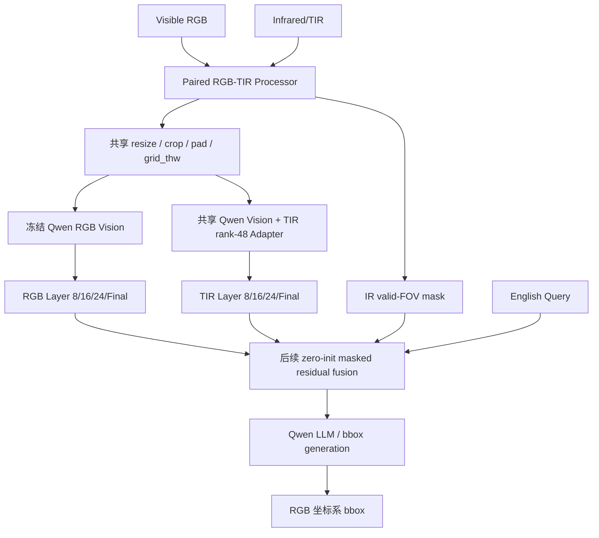

# AIC RGB–TIR 红外模块持续更新技术报告

> 文档性质：持续更新（Living Document）
> 当前版本：v1.0
> 最近更新：2026-08-14（Asia/Shanghai）
> 当前分支：`exp/aic-rgbtir-phase17a-plus-v1`
> 当前阶段：Phase 1.7A+ 已完成，下一条唯一主线为 `D1_RETENTION_PROBE`
> 适用项目：2026 AIC 算法挑战赛赛题一「基于大模型的多模态视觉理解与推理」

## 阅读与更新约定

本报告用于统一记录红外模块从提出、工程化、训练、失败诊断、修复到后续融合的全过程。后续每完成一个阶段，应同步更新：

1. 顶部版本、日期和当前状态；
2. “过程进度”表；
3. 新增实验的配置、输入资产、指标、结论边界；
4. “当前唯一下一步”；
5. 文末更新日志。

报告严格区分四类信息：

- **平台事实**：AIC 官方平台返回的 ACC@0.5；
- **外部验证事实**：RGBT-GroundBench 等带 GT 数据上的机器指标；
- **诊断代理**：质量分数、假负例率、配准风险等启发式或模型代理；
- **待验证假设**：尚未经过训练或对照实验的结构与优化方案。

任何表征指标都不得直接写成 AIC 定位提升，任何无标签 AIC 输入画像都不得写成 GT 统计。

---

# 一、算法概述

本项目面向 AIC 多模态语言引导目标定位任务：模型接收可见光、红外、深度图像和英文 Query，输出目标在原始 RGB 图像坐标系中的归一化边界框。当前红外路线以已验证的 Qwen3-VL RGB-only 能力为锚点，不复制第二套完整视觉大模型，而是在共享 Qwen3-VL 视觉塔上增加 TIR 专用低秩适配器，通过同步几何预处理、红外有效视场 mask、DeepStack 多层特征接口和零初始化残差，为模型提供可拒绝的红外增量证据。算法设计强调“先保护 RGB，再学习红外；先证明表征健康，再验证 Query 相关性，最后才融合”。现阶段已完成数据与接口验收、TIR rank-48 Adapter 训练、全量表征验证、低秩坍缩诊断、InfoNCE/关系蒸馏去坍缩和逐层漂移复核。当前证据表明：红外特征的跨实例区分能力已经恢复，但 Layer 8/16/24，尤其 Layer 24，出现相对 Base TIR 的真实语义漂移。下一轮仅增加 Base-relative retention 约束，在保留 C2 检索与有效秩优势的同时抑制过度漂移；尚未进入正式 Query-aware RGB–TIR 融合，也尚未证明 AIC 平台增益。

---

# 二、任务背景与控制基线

## 2.1 AIC 任务

输入：

```text
Visible RGB + Infrared/TIR + Depth + English Query
```

输出：

```text
目标在原始 RGB 图像上的 normalized bbox
[x1, y1, x2, y2]
```

当前研究范围限定为：

```text
RGB + TIR + Query → RGB bbox
```

Depth 暂缓，避免同时引入毫米深度、未知 JPG 深度域、第三模态编码和额外坐标映射，使实验无法归因。

## 2.2 RGB-only 控制基线

| 模型 | 输入 | AIC ACC@0.5 | 说明 |
|---|---|---:|---|
| Qwen3-VL-8B-Instruct | RGB + Query | 0.7582 | 红外模块的干净、低成本控制组 |
| Qwen3-VL-30B-A3B-Instruct-FP8 + 8B 补框 | RGB + Query | 0.7757 | 历史最高参考，但不是纯 30B 无补框控制 |

红外模块优先在 8B 开发，原因是：

- 8B 已有稳定、可复现的平台结果；
- 8B 训练和消融成本显著低于 30B；
- 8B/30B 视觉塔均有 27 层、1152 维 pre-merger 特征和 DeepStack 8/16/24 接口；
- 只有 8B 红外融合获得可归因净收益，才值得迁移到 30B；
- 后续正式模型不采用第二模型替代红外失败样本，红外无效时只允许同一模型退化为 RGB-only。

## 2.3 红外模块的安全目标

红外不是强制主模态，而是可拒绝的辅助证据：

```text
IR 无价值 / 质量差 / 有效视场不足 / 配准风险高 / Query 不需要热信息
→ TIR contribution = 0
→ 同一模型严格退化为 RGB-only
```

目标是在低光、热目标、遮挡、远距离和小目标场景产生更多 Rescue，同时将颜色、纹理、OCR 和普通光场景中的 Harm 控制到最低。

---

# 三、方案来源与初始算法设计

## 3.1 主要参考路线

红外模块首先参考 RGBT-GroundBench / RGBT-VGNet 的三类思想：

1. **AMA（Asymmetric Modality Adaptation）**：预训练视觉模型天然偏 RGB，TIR 分支需要更强适配容量；
2. **LAVS（Language-Aware Visual Synergy）**：先用语言筛选 Query 相关视觉区域，再做 RGB/TIR 交互；
3. **TPF（Tri-Prior Fusion）**：融合权重同时考虑照明、局部语义和全局可靠性。

当前工程没有照搬论文网络，而是先迁移最小可验证部分：

```text
RGB rank = 0（完全冻结）
TIR rank = 48
只适配 Qwen vision attention qkv / proj
```

这比论文中 RGB/TIR 双 LoRA 更保守，目的是先保护已经验证的 Qwen RGB 能力。

## 3.2 初始结构



## 3.3 关键工程接口

- 不修改安装环境中的 `transformers/modeling_qwen3_vl.py`；
- 通过 wrapper/hook 获取视觉层 8、16、24 和 final 的 1152 维 pre-merger hidden states；
- RGB/TIR 共享完全相同的几何变换和 `grid_thw`；
- 红外黑边只屏蔽与外边界连通的近黑 padding，避免误删内部暗目标；
- 最终 bbox 始终在 RGB 原始坐标系；
- `tir=None`、IR 无效或融合尺度为 0 时，输出与原生 RGB-only 等价；
- 不存在第二模型 fallback 接口。

## 3.4 为什么选择 DeepStack 8/16/24

Qwen3-VL 不只在 final merger 注入视觉信息，DeepStack 的 8/16/24 层也参与后续多模态理解。只修改 final projector 会遗漏大部分层级视觉交互。因此本项目从一开始就将红外适配与诊断覆盖 Layer 8/16/24/final，并把 Final 作为诊断层而非强门禁层。

---

# 四、数据准备、清理与模态审计

## 4.1 RGBT-GroundBench

| 项目 | 数量 |
|---|---:|
| 原始 grounding 实例 | 38,760 |
| 唯一 RGB/TIR 图像对 | 21,535 |
| 官方 train | 26,604 |
| clean train | 26,477 |
| official val | 2,032 |
| official test | 10,124 |

训练清理排除 127 条记录：

- `bbox_meta_language`；
- `negative_or_absent_language`；
- 两个 train/val 重叠图像对对应的 train 记录。

val/test 不因语言质量标志删样本，保持官方评测口径。

## 4.2 数据隔离

Phase 1.6/1.7 使用固定切分：

| 切分 | 记录数 | 唯一图像对 |
|---|---:|---:|
| repair probe train | 4,096 | 4,096 |
| repair dev | 1,024 | 1,024 |
| repair full train | 24,612 | 13,822 |
| official val | 2,032 | 1,115 |

已验证：`probe_dev=0`、`full_dev=0`、`train_official_val=0`。

## 4.3 黑边、有效视场与 Grid

| 数据 | 成功读取 | 检出黑边 | 低信息 IR | 可用 IR | RGB/TIR grid 一致 |
|---|---:|---:|---:|---:|---:|
| RGBT-GroundBench | 21,535/21,535 | 4,056 | 0 | 21,534 | 21,535/21,535 |
| AIC 唯一图像组 | 2,000/2,000 | 1,439 | 0 | 1,998 | 2,000/2,000 |

AIC 统计是输入审计事实，不包含 bbox GT，因此不能推出红外一定提升或下降。

## 4.4 数据域风险

RGBT-GroundBench 与 AIC 任务形式高度接近，但仍存在域差异：

- AIC 中可见黑边、倾斜有效边界和弱配准风险；
- AIC Query 包含大量关系、序数、区域和建筑部件；
- RGBT-GroundBench 的标注与筛选更偏道路参与者和可稳定标注目标；
- official val 通过不等价于 AIC 平台增分。

因此后续只能用 RGBT 数据选择训练方案，最终是否保留红外模块必须由受控 AIC 平台提交确认。

---

# 五、实现方案与训练目标演进

## 5.1 Phase 1 原始目标

Phase 1 只训练 TIR rank-48 Adapter：

```text
paired RGB-TIR ROI alignment
+ same-image background margin
```

RGB 视觉塔、LLM、fusion gate 和 bbox head 全部冻结。

该目标回答的是：

> TIR Adapter 能否学习冻结 RGB Teacher 的目标区域表征？

它不能回答 Query 是否受益，也不能回答 bbox 是否提高。

## 5.2 Phase 1.6 去坍缩候选

| 候选 | 损失结构 | 目的 |
|---|---|---|
| C0 | paired alignment + background margin | 历史控制 |
| C1 | C0 + 256 个跨图 RGB 负例 InfoNCE | 防止不同目标聚集 |
| C2 | C1 + relational distillation | 保留 RGB Teacher 的实例关系结构 |

负样本固定为：

```text
128 同来源 + 64 同条件 + 64 全局随机
```

禁止来自相同图像对，并绑定固定数据切分、随机种子和 Teacher Bank fingerprint。

## 5.3 当前建议的 D1 目标

保留 C2 主体：

```text
0.25 × paired alignment
+ 1.00 × InfoNCE
+ 0.50 × relational distillation
+ 0.10 × background margin
```

新增逐层 Base-relative retention：

\[
L_{retain,l}=\operatorname{ReLU}
\left(\cos_{base,l}-\epsilon_l-\cos_{adapted,l}\right)
\]

建议容差：

```text
epsilon_8  = 0.02
epsilon_16 = 0.02
epsilon_24 = 0.01
Final      = 仅诊断
```

Retention 与再次提高 paired loss 不同：只有 adapted TIR 比 Base TIR 差超过容差时才产生梯度，避免持续强迫 TIR 完全复制 RGB。

---

# 六、过程进度

| 日期 | 阶段 | 状态 | 主要完成内容 | 核心结论 |
|---|---|---|---|---|
| 2026-08-11～12 | 数据与论文审计 | 完成 | RGBT-GroundBench、AIC 黑边/位深/配准风险审计 | 采用 8B-first、RGB 锚点、TIR 可拒绝残差路线 |
| 2026-08-12 | Phase 0 | `PHASE_0_GO` | manifest、processor、mask、grid、坐标、包装器等价性 | 工程链路可训练，gate=0 与 RGB-only 完全等价 |
| 2026-08-12 | Phase 1 smoke/overfit/tracer | GO | 真实 Qwen 视觉权重、10 条 smoke、100 条过拟合、400 条 tracer | 梯度只进入 TIR Adapter，RGB 哈希不变 |
| 2026-08-12 | Phase 1 full warmup | GO | clean train 26,477/26,477 | 配对 alignment 明显改善，但未验证表征区分度 |
| 2026-08-12 | Phase 1.5 full validation | `NO_GO` | official val 2,032 条检索与坍缩检查 | R@1/R@5 提升，但 Layer 8/16/24 严重低秩坍缩 |
| 2026-08-13 | Phase 1.6 probe | `NO_GO` | C0/C1/C2 去坍缩候选 | C2 最佳；有效秩恢复，但 alignment 门禁失败 |
| 2026-08-13 | 云端资产恢复 | 完成 | 重建 Teacher Bank、C1/C2 Adapter、summary、逐记录诊断 | 解决实例释放导致的证据缺失；C0 历史 summary 仍缺失但不阻塞 |
| 2026-08-13 | Phase 1.7A+ | `COMPLETE` | 1,024 条逐层绝对诊断、质量和假负例代理分析 | 确认真实中层漂移，唯一后续为 `D1_RETENTION` |
| 2026-08-14 | 持续技术报告 | 当前 | 汇总设计、实现、失败、修复和下一步 | 尚未进入正式融合与 AIC 多模态提交 |

---

# 七、关键实验结果

## 7.1 Phase 1：对齐改善

云端环境：RTX 4090 24GB、PyTorch 2.6.0+cu124、Transformers 4.57.6、Qwen3-VL-8B 固定 revision。

| 项目 | 结果 |
|---|---:|
| 训练记录 | 26,477/26,477 |
| skipped/fallback | 0/0 |
| 可训练参数 | 8,957,952（全部 TIR Adapter） |
| official-val-100 loss | 0.152710 → 0.073343 |
| 相对改善 | 51.97% |

分层 paired cosine：

| 层 | Base | Adapted |
|---|---:|---:|
| Layer 8 | 0.71715 | 0.87767 |
| Layer 16 | 0.78759 | 0.90987 |
| Layer 24 | 0.95479 | 0.97669 |
| Final | 0.99539 | 0.99694 |

`51.97%` 是表征 alignment loss 改善，不是 ACC@0.5。

## 7.2 Phase 1.5：低秩坍缩

| 层 | Base effective rank | Adapted effective rank | R@1 Base→Adapted | R@5 Base→Adapted |
|---|---:|---:|---:|---:|
| Layer 8 | 99.45 | 30.39 | 26.08%→50.39% | 44.00%→70.03% |
| Layer 16 | 77.42 | 22.72 | 42.22%→71.06% | 61.07%→85.63% |
| Layer 24 | 59.87 | 22.94 | 33.81%→65.01% | 53.79%→83.61% |
| Final | 约 1.02 | 约 1.02 | 23.97%→46.90% | 40.50%→64.27% |

结论：正确配对变得更近，但大量不同目标被压缩到相似子空间。Phase 1 Adapter 不能直接融合。

## 7.3 Phase 1.6：去坍缩结果

| 指标 | Base TIR | C0 | C1 | C2 |
|---|---:|---:|---:|---:|
| 平均 R@5 | 60.45% | 69.50% | 82.39% | **83.56%** |
| 平均 R@1 | — | 48.93% | 57.65% | **60.03%** |
| 最低有效秩/Base | — | 36.63% | 89.29% | **89.77%** |
| 最低有效秩/RGB Teacher | — | 37.83% | 81.47% | **81.90%** |
| paired-shuffled margin | — | 0.0557 | **0.1800** | 0.1698 |

结论：InfoNCE 是恢复跨实例区分度的关键，relational distillation 对检索和有效秩有小幅正贡献。C2 是最值得保留的修复基座，但它没有通过 alignment 门禁。

## 7.4 Phase 1.7A+：确认真实漂移

| 层 | Base paired cosine | C2 paired cosine | C2 alignment loss - Base loss |
|---|---:|---:|---:|
| Layer 8 | 0.73645 | 0.60752 | +0.12893 |
| Layer 16 | 0.79743 | 0.64481 | +0.15261 |
| Layer 24 | 0.95983 | 0.57607 | **+0.38376** |
| Final | 0.99664 | 0.99674 | -0.00010 |

Layer 24 漂移最大。Final 在 Base/C2/Teacher 中有效秩都接近 1，属于结构性饱和，只用于诊断，不能代表中层表征健康。

## 7.5 RGB Teacher 质量关联

| 信号 | 与 C2 漂移的 Spearman | bootstrap 95% CI |
|---|---:|---:|
| 全图 RGB 亮度 | -0.1486 | [-0.2077, -0.0870] |
| 全图 RGB 模糊度 | -0.1201 | [-0.1821, -0.0594] |
| ROI RGB 对比度 | -0.1370 | [-0.1981, -0.0780] |
| ROI RGB 熵 | -0.1404 | [-0.2031, -0.0782] |
| IR 有效视场比例 | -0.0716 | [-0.1347, -0.0104] |
| RGB Teacher 目标—背景 margin | -0.2464 | [-0.3054, -0.1862] |

方向稳定但效应量较弱，不能把 RGB 质量认定为主要根因，因此暂不进入质量加权训练路线。

## 7.6 假负例代理

| 指标 | 结果 |
|---|---:|
| 固定 256 跨图负例词法潜在假负例率 | 8.50% |
| 高 Query 词集相似率 | 0.54% |
| 模型 top-neighbor 潜在假负例代理率 | 19.01% |
| same-pair 违规 | 0 |

这些结果不是人工真值，不足以证明 InfoNCE 假负例是 C2 漂移主因，因此不优先进入 false-negative-aware 分支。

---

# 八、遇到的主要问题与解决过程

## 8.1 JPG/PNG 与 Depth 位深差异

问题：不同文件格式和模态的实际 dtype、通道和数值含义不同，不能统一除以 255。

处理：

- RGB/TIR 按真实解码结果归一化；
- PNG uint16 Depth 保留毫米值和 invalid mask；
- JPG uint8 Depth 单独标记为未知相对深度域，不解释为毫米；
- 红外三通道一致性和黑边单独审计。

## 8.2 红外黑边、倾斜边界与弱配准

问题：TIR 有大量黑边和倾斜有效视场，RGB/TIR 仅尺寸一致不代表像素级严格对齐。

处理：

- 边界连通黑区生成 `ir_valid_mask`；
- RGB/TIR 使用相同 resize/grid；
- mask 同步下采样到 patch/merged token；
- 当前不自动仿射校正，弱配准模块必须等待融合 Harm 证据后再进入。

## 8.3 Phase 1 “对齐很好”却发生坍缩

问题：训练只优化正确配对，没有跨图负例，模型可通过压缩所有目标表示降低 paired loss。

处理：Phase 1.5 引入跨样本检索、非配对相似度和 effective rank 硬门禁；Phase 1.6 加入 InfoNCE 和 relational distillation。

## 8.4 C2 去坍缩后又出现中层漂移

问题：强判别约束把不同目标分开，也把 RGB/TIR 共享语义拉开，Layer 24 尤其严重。

处理：Phase 1.7A+ 重新计算绝对 drift，排除“小分母百分比失真”；选择 Base-relative retention，而不是简单重新提高 paired 权重。

## 8.5 云端实例释放导致关键资产丢失

问题：早期只保留报告和 manifest，C1/C2 Adapter、Teacher Bank、逐记录诊断留在临时实例，无法继续 Phase 1.7A+。

处理：重新构建共同 Teacher Bank，按相同初始化和口径重跑 C1/C2，将归档拉回本地并核验 SHA-256。当前已恢复：

- Teacher Bank：5,120 对；
- C1 Adapter SHA-256：`0D56149083B9EFCFA30DDBB30904A70D631EBA5E080EA2DCD63F123BEFAA85EE`；
- C2 Adapter SHA-256：`2832225394CD884D5BA972D9BCD0E19CE8AF8715657DC9675E60AB75B103E786`；
- repair-dev：1,024 条，图像对隔离；
- 回传归档 SHA-256：`3AEAF519809D9FE7BE2818F7C36787667A10444422465FE4A98B8E8CBD37DECE`。

后续所有云端训练必须先定义持久化和回传清单，不能只保存 Markdown 汇总。

## 8.6 报告生成器与机器结果不一致

问题：旧报告在资产已齐全时仍输出 `ASSET_BLOCKED`；C2 诊断在 subgroup 表写出后才连接，造成字段恒为不可用。

处理：修复执行顺序与报告条件，新增回归测试。Phase 1.7A+ 当前为：

```text
ASSETS_READY
1024/1024 completed
8 tests passed
repeat-run SHA-256 byte-stable
```

---

# 九、算法创新点与工程价值

## 9.1 面向 Qwen3-VL 的非对称红外适配

把 RGBT-VGNet 的 AMA 思想迁移到 Qwen3-VL 视觉塔：RGB 主路完全冻结，TIR 使用 rank-48 Adapter，在不破坏已验证 RGB 能力的前提下学习跨谱表示。

## 9.2 动态网格与黑边感知的成对处理

共享几何变换、动态 `grid_thw` 和边界连通 mask 保证不同分辨率、长宽比和倾斜黑边下的 token 对应关系，避免把黑色 padding 当作热信息。

## 9.3 多层 hook 与 DeepStack 一致性

直接验证 Layer 8/16/24/final，而不是仅观察最终 projector，从而发现“Final 看似正常、中层已经漂移”的隐藏问题。

## 9.4 零初始化、同模型可拒绝残差

所有未来融合采用 `tanh(alpha)` 且 `alpha=0` 初始化。IR 缺失、低质量或无关时，同一模型退化为原生 RGB-only，不依赖第二模型补框。

## 9.5 从单一对齐指标升级为多目标硬门禁

同时检查：

- alignment；
- R@1/R@5；
- effective rank；
- nonpaired cosine P95；
- paired-shuffled margin；
- 分组退化；
- RGB 参数哈希和安全等价性。

该门禁先发现 Phase 1 坍缩，再发现 C2 过度漂移，避免错误进入融合。

## 9.6 Base-relative retention 路线

D1 不要求 TIR 完全复制 RGB，而是将 Base TIR 作为最低共享语义边界，只惩罚越界漂移，目标是在“对齐、判别、红外独有信息”之间建立可控约束。

---

# 十、当前结论边界

## 已验证

- 数据、坐标、mask、grid 和 RGB-only 等价链路可信；
- TIR rank-48 Adapter 可以稳定训练；
- 单纯 paired alignment 会产生低秩坍缩；
- InfoNCE 显著恢复跨实例区分度；
- relational distillation 对 C2 检索和有效秩有小幅正贡献；
- C2 在 Layer 8/16/24 发生真实漂移，Layer 24 最严重；
- RGB 质量和假负例代理尚不足以支持对应分支；
- 当前唯一有证据支持的下一步是 D1 retention。

## 尚未验证

- Query 是否能够利用 D1 TIR 特征；
- RGB+TIR 是否提高 RGBT-GroundBench grounding ACC；
- 红外融合的 Rescue/Harm；
- AIC 平台 ACC 是否超过 8B RGB-only 0.7582；
- Shared/Complementary 双分支是否必要；
- Query/Quality/Registration 三重门控是否优于更简单结构；
- 红外模块能否安全迁移到 30B；
- Depth 融合收益。

---

# 十一、下一阶段实施计划

## 11.1 Phase 1.7B：D1 Retention Probe

所有候选从完全相同的 fresh rank-48 Adapter 初始化开始，固定 Teacher Bank、负例、切分、种子、优化器和训练步数，只改变 retention 强度：

```text
D1-A: lambda_ret = 0.10
D1-B: lambda_ret = 0.25
D1-C: lambda_ret = 0.50
```

使用 4,096 条 repair probe train 训练，1,024 条 repair-dev 选择；official val 不参与调参。

### Probe 硬门禁

相对 C2 同时满足：

1. Layer 8/16/24 absolute drift 全部下降；
2. Layer 24 drift 至少下降 25%；
3. mean R@5 下降不超过 0.5 个百分点；
4. mean R@1 下降不超过 1 个百分点；
5. 最低 effective-rank/Base TIR 不低于 85%；
6. 最低 effective-rank/RGB Teacher 不低于 75%；
7. paired-shuffled margin 保持为正；
8. nonpaired cosine P95 不触发原门禁；
9. RGB base 哈希不变，只有 TIR Adapter 获得梯度；
10. 无 NaN/Inf、空 ROI 或第二模型 fallback。

候选按 Pareto 原则选择：对齐修复最多，同时检索与有效秩损失最小。

## 11.2 D1 Full Train 与 official val

只有 probe 通过才允许：

1. 选定唯一 `lambda_ret`；
2. 从 fresh Adapter 在 24,612 条 full train 重训；
3. 保存 25%/50%/75%/100% checkpoint；
4. repair-dev 多指标选择 checkpoint；
5. 最后一次性在 2,032 条 official val 验收。

## 11.3 Phase 1.8：Query–TIR Grounding Probe

比较 Base TIR、C2、D1 在以下任务中的表现：

- Query-to-target retrieval；
- target-vs-distractor；
- same-category instance discrimination；
- target-vs-reference；
- target-vs-part；
- small-target、low-light、occlusion 分组。

视觉主干冻结，使用同一轻量语言条件评分头，避免把评分头能力误认为 Adapter 能力。

## 11.4 Phase 2：最小安全融合

严格单变量顺序：

```text
A. RGB-only control
B. TIR-only diagnosis
C. RGB + TIR static tiny zero-init gate
D. C + Query-aware gate
E. D + IR quality gate
F. 仅在 weak-alignment Harm 明显时增加 registration gate
G. modality dropout / degradation guard
```

第一版继续使用 Qwen 原生 bbox 输出，避免同时改变融合和输出协议。

## 11.5 AIC 平台与 30B 迁移

8B RGB–TIR 必须以 `0.7582` 为控制，建议实质提升线：

```text
ACC@0.5 >= 0.7632
```

同时要求非法框为 0、无第二模型补框，并记录 gate 分布。只有 8B 获得稳定净收益，再迁移到 30B pre-merger 1152 维接口；Depth 继续暂缓。

---

# 十二、停止条件

出现任一情况即停止当前支线：

1. D1 再次导致有效秩显著坍缩；
2. D1 无法降低 Layer 24 漂移；
3. Query–TIR probe 不优于 Base TIR；
4. Fusion 的 Harm 接近或超过 Rescue；
5. 普通光、颜色、纹理或 OCR Query 系统性下降；
6. gate 长期趋近全 0 或全 1；
7. weak-alignment 样本未能自动降低 IR 权重；
8. AIC 8B 未达到预注册实质提升线；
9. 出现非法 bbox、TIR 坐标系输出或跨模型 fallback。

回退方式永远是：

```text
关闭同一模型的 TIR gate → 恢复原 RGB-only 路径
```

---

# 十三、团队分工

当前仓库未登记完整参赛成员姓名，因此本报告不虚构人员信息。建议团队补充下表中的姓名：

| 角色 | 当前职责 | 姓名 |
|---|---|---|
| 算法负责人 | RGB–TIR 架构、损失、门禁与实验决策 | 待团队填写 |
| 数据工程 | RGBT/AIC 审计、manifest、mask、split 隔离 | 待团队填写 |
| 训练工程 | 云端环境、checkpoint、Teacher Bank、断点续训 | 待团队填写 |
| 验证分析 | 检索、有效秩、漂移、Rescue/Harm 与报告 | 待团队填写 |
| 文档与提交 | 技术报告、GitHub 索引、平台提交审计 | 待团队填写 |

Codex 作为工程辅助工具参与代码实现、审计、验证和文档整理，不替代参赛团队成员署名。

---

# 十四、复现资产与关键指纹

| 资产 | 标识 |
|---|---|
| Qwen3-VL-8B revision | `0c351dd01ed87e9c1b53cbc748cba10e6187ff3b` |
| Phase 1 Adapter SHA-256 | `F8B81349886702497ABC936BCAF1DB4660CF7B3290B2569AE80C303CE362DF7B` |
| C1 Adapter SHA-256 | `0D56149083B9EFCFA30DDBB30904A70D631EBA5E080EA2DCD63F123BEFAA85EE` |
| C2 Adapter SHA-256 | `2832225394CD884D5BA972D9BCD0E19CE8AF8715657DC9675E60AB75B103E786` |
| Teacher Bank fingerprint | `79CF814B64EC640AD3D924342FEEED235764F139445F834B2CDB2DD0B580C05C` |
| repair-dev SHA-256 | `B9DFB8C4E47CAD542326BD25D5B2054EA7CADD64E6AA12BA72E2E7B84CD5D1D7` |
| Phase 1.6 恢复归档 SHA-256 | `3AEAF519809D9FE7BE2818F7C36787667A10444422465FE4A98B8E8CBD37DECE` |

大数据、模型权重、Teacher Bank 和 `outputs/` 不上传 GitHub；GitHub 保存代码、配置模板、指标、哈希和报告。

---

# 十五、解题参考

## 核心资料

1. RGBT-GroundBench / RGBT-VGNet 论文：<https://arxiv.org/abs/2512.24561>
2. 官方代码：<https://github.com/crazyxiaoxi/RGBT-GroundBench>
3. 官方数据集：<https://huggingface.co/datasets/JiawenXi/RGBT-Ground-Dataset>
4. Qwen3-VL 官方模型：<https://huggingface.co/Qwen/Qwen3-VL-8B-Instruct>

## 后续按需研究，不在当前轮同时实现

- IV-tuning：低秩适配下的特征空间保护；
- M²D-LIF：Fusion Degradation 与单模态蒸馏；
- UniRGB-IR：冻结 RGB foundation model 的补充特征注入；
- RSDet：先去除无效红外信息再选择融合；
- C²Former / Cascade Alignment-Guided Transformer：弱配准特征校准；
- 多光谱基础模型：长期的专业 TIR 初始化方向。

---

# 十六、当前唯一结论

当前最重要的矛盾不是“如何尽快把红外接进 Qwen”，而是：

> 如何让 TIR 在保留 C2 已恢复的目标区分能力时，不丢失与 RGB 共享的目标语义，并且最终只在 Query 和图像条件真正需要红外时提供增量证据。

因此当前唯一下一步是 `D1_RETENTION_PROBE`。在它通过以前，不启动 Shared/Complementary 双分支、不加入三重门控、不做正式 AIC RGB–TIR 提交，也不迁移 30B 或引入 Depth。

---

# 十七、更新日志

## v1.0 — 2026-08-14

- 首次建立持续更新主报告；
- 汇总算法提出、数据审计、Phase 0/1/1.5/1.6/1.7A+ 全过程；
- 记录低秩坍缩、真实逐层漂移、云端资产丢失与报告一致性问题；
- 固化当前唯一后续路线 `D1_RETENTION_PROBE`；
- 明确平台事实、外部验证事实、代理指标和未验证假设的边界。
