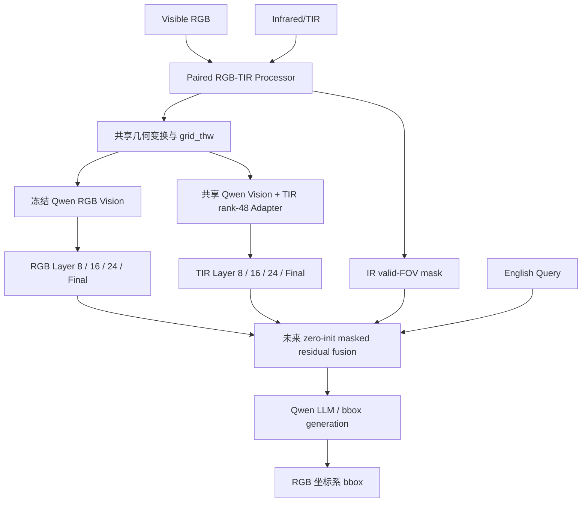

# AIC RGB–TIR 红外模块全路线、Phase 1.8R 结果与后续方向

> 文档用途：交给 ChatGPT 网页端或团队成员进行独立技术复核
> 生成日期：2026-08-15（Asia/Shanghai）
> 当前代码分支：`exp/aic-rgbtir-phase18r-v1`
> 当前代码提交基点：`f22d14170cf01f1a2adb47ded972b02900155a57`
> 当前最终状态：`PHASE_18_FULL_NO_GO`
> 适用任务：2026 AIC 算法挑战赛赛题一，多模态语言引导单目标定位
> 当前模型基座：`Qwen/Qwen3-VL-8B-Instruct`

---

## 0. 阅读说明与结论边界

这份报告完整记录红外模块从提出、数据工程、模型接口、初始训练、表征坍缩、去坍缩修复、逐层漂移诊断、D1 retention、全量训练到 sealed official-val 的全过程。

必须严格区分以下四类事实：

1. **AIC 平台事实**：AIC 平台返回的 `ACC@0.5`；
2. **RGBT-GroundBench 验证事实**：有标注 RGB–TIR 数据上的检索、对齐、有效秩和分组指标；
3. **工程安全事实**：坐标、mask、grid、模型哈希、fallback 和等价性检查；
4. **待验证假设**：Query、融合、门控、Depth 和 AIC 平台增益。

最新 Phase 1.8R **没有运行 AIC 测试集，也没有生成 AIC 提交包或新平台分数**。它完成的是 RGBT-GroundBench 上的红外表征全量训练与一次性 official-val 验收。因此不能把本轮 R@1/R@5 写成 AIC 定位分数，也不能宣称红外已经提高 AIC ACC。

---

# 一、执行摘要

## 1.1 当前一句话结论

最新 D1_L050 红外 Adapter 已经显著恢复并增强跨实例检索能力，且相对 C2 大幅降低 Layer 8/16/24 漂移；但在 sealed official-val 上仍出现 **Layer 8 有效秩低于预注册阈值、全局/分组 RGB 对齐恶化，以及一个可定位的验证状态错误**。因此它是一个有价值的研究资产，但尚不能直接进入正式 RGB–TIR 融合或 AIC 平台提交。

## 1.2 本轮不是“训练失败”

Phase 1.8R 的训练和验证流程完整完成：

- Teacher Bank：`15,961/15,961` 图像对；
- full train：`24,612/24,612` step；
- 四个 checkpoint：25% / 50% / 75% / 100% 全部保存；
- repair-dev：完成并选择 100% checkpoint；
- official val：`2,032/2,032` 记录、`1,115/1,115` 唯一图像对；
- skipped：`0`；
- second-model fallback：不存在；
- 最终归档与本地文件：全部回传并通过 SHA-256 校验。

`NO_GO` 是预注册科研门禁给出的结论，不是云端任务异常退出。

## 1.3 最新证据的积极部分

- Layer 8 R@5：`43.996% → 91.339%`；
- Layer 16 R@5：`61.024% → 90.699%`；
- Layer 24 R@5：`53.691% → 75.394%`；
- 平均 R@1：`66.257%`；
- 平均 R@5：`85.810%`；
- 最低 paired-shuffled margin：`0.18267`；
- margin bootstrap 95% 下界：`0.17936 > 0`；
- nonpaired cosine P95 相对 Base TIR 没有恶化，反而明显降低；
- `gate=0`、`tir=None`、IR 无效和全零 IR mask 时，与 RGB-only 的最大差异均为 `0.0`；
- RGB base 参数哈希训练前后完全一致。

## 1.4 最新证据的关键问题

1. Layer 8 的有效秩仅为 Base TIR 的 `80.38%`，低于预注册 `85%`；
2. adapted TIR 与 RGB Teacher 的总体 alignment loss 从 `0.16077` 上升到 `0.25878`，即相对恶化 `60.96%`；
3. 低质量光照、特定天气、FLIR、小目标和遮挡等分组的 alignment 相对恶化明显；
4. `no_trainable_parameters=false` 使 safety 总门禁失败，但现有代码证据表明这是 official-val 前只调用 `eval()`、没有清除 Adapter 的 `requires_grad` 标志造成的验证状态问题；其他安全项全部通过，RGB 哈希和等价性没有异常；
5. 当前分组门禁只比较“靠近 RGB Teacher 的程度”，可能把全局对齐漂移重复计为每个分组退化，尚未直接衡量该分组的检索 Harm 或 Query grounding Harm。

## 1.5 当前最合理的下一步

暂时不租卡、不盲目重训、不进入正式融合。先使用已经回传的 official-val embedding cache 完成一轮 **Phase 1.8R-Audit 本地证据复核**：

1. 修复并重跑安全状态检查；
2. 逐层确认有效秩损失集中在哪里；
3. 将“全局 alignment 漂移”和“组间额外退化”拆开；
4. 增加按分组的 R@1/R@5、margin、effective rank 和 Rescue/Harm；
5. 在不改变本轮 `NO_GO` 历史结论的前提下，判断真正需要修的是模型还是验证门禁。

只有这一步完成后，才能决定：

- 进入一个只修 Layer 8 秩保持的单变量 probe；或
- 如果问题主要来自门禁口径，而表征的任务判别性健康，则进入冻结的 Query–TIR 诊断 probe。

---

# 二、任务、基线与最终目标

## 2.1 任务形式

```text
Visible RGB + Infrared/TIR + Depth + English Query
→ 目标在原始 RGB 图像坐标系中的 normalized bbox
→ [x1, y1, x2, y2]
```

当前阶段仅研究：

```text
RGB + TIR + Query → RGB bbox
```

Depth 暂缓，原因是它会同时引入 uint16 毫米深度、JPG 未知相对深度域、第三模态编码、额外空间映射和更多门控变量，破坏单变量归因。

## 2.2 RGB-only 控制基线

| 模型 | 输入 | AIC ACC@0.5 | 结论边界 |
|---|---|---:|---|
| Qwen3-VL-8B-Instruct | RGB + Query | 0.7582 | 红外模块的主要干净控制组 |
| Qwen3-VL-30B-A3B-Instruct-FP8 + 8B 补框 | RGB + Query | 0.7757 | 历史最高，但不是无补框纯 30B 控制 |

本项目明确不允许在最终红外路线中使用第二模型 fallback。IR 无效时只能让同一个模型的 TIR 增量退化为 0，并恢复原生 RGB-only 路径。

## 2.3 红外模块最终目标

红外的价值不应是“让 TIR 模仿 RGB”，而应同时包含：

```text
共享信息：位置、轮廓、主体语义、对象关系
互补信息：热轮廓、低光可见性、热显著性、遮挡下的目标证据
```

最终融合应满足：

```text
IR 有用且 Query 需要 → 提供增量证据
IR 无关 / 低质量 / 配准风险高 → contribution 接近 0
任何时候 → RGB 主路径保持可恢复、可审计
```

---

# 三、红外模块的核心工程架构

## 3.1 初始结构



## 3.2 非对称适配

参考 RGBT-GroundBench / RGBT-VGNet 的 AMA 思路，但采用更保守的 Qwen 适配：

```text
RGB LoRA rank = 0
TIR LoRA rank = 48
只覆盖 Qwen Vision attention qkv / proj
RGB / LLM / 视觉基础参数全部冻结
```

原因：Qwen 的视觉预训练主要来自 RGB，TIR 需要额外域适配；但已经验证的 RGB-only 能力必须作为不可破坏的锚点。

## 3.3 为什么检查 Layer 8/16/24/Final

Qwen3-VL 的视觉信息不只通过最终 merger 注入，DeepStack 中间层也参与多模态理解。只检查 final 会掩盖中层结构问题。因此项目从 Phase 0 开始固定捕获：

```text
Layer 8
Layer 16
Layer 24
Final
```

Final 层在多轮验证中 effective rank 都接近 1，属于结构性饱和，只作为诊断层，不能单独决定 GO/NO-GO。

## 3.4 安全融合接口

未来融合保持零初始化残差：

```text
fused = rgb + tanh(alpha) × valid_mask × project(tir)
alpha 初始为 0
```

硬约束：

- 不修改 Transformers 安装源码；
- 最终 bbox 永远位于 RGB 原始坐标系；
- `tir=None`、IR 无效、全零 mask 或 gate=0 时严格等价于 RGB-only；
- 不存在第二模型 fallback；
- 所有模型改动都必须能通过参数哈希和 tensor-level 审计。

---

# 四、数据准备与预处理

## 4.1 RGBT-GroundBench

| 项目 | 数量 |
|---|---:|
| 原始 grounding 实例 | 38,760 |
| 唯一 RGB/TIR 图像对 | 21,535 |
| 官方 train | 26,604 |
| clean train | 26,477 |
| official val | 2,032 |
| official test | 10,124 |

训练清理排除 127 条：

- `bbox_meta_language`；
- `negative_or_absent_language`；
- 两个 train/val 重叠图像对对应的 train 记录。

official val/test 不因语言质量标志删样本，保证评测口径不被人为改变。

## 4.2 固定数据切分

| 切分 | 记录数 | 唯一图像对 | 用途 |
|---|---:|---:|---|
| repair probe train | 4,096 | 4,096 | 低成本候选筛选 |
| repair dev | 1,024 | 1,024 | checkpoint/候选选择 |
| repair full train | 24,612 | 13,822 | D1 全量训练 |
| official val | 2,032 | 1,115 | sealed 一次性最终验收 |

图像对交集：

```text
probe ∩ dev = 0
full ∩ dev = 0
full ∩ official = 0
dev ∩ official = 0
```

## 4.3 RGB/TIR 成对预处理

流程：

```text
读取 RGB/TIR
→ 计算一次共享 resize 几何
→ 两模态应用相同 resize/crop/pad
→ 分别使用 Qwen 图像归一化
→ 生成完全一致的 image_grid_thw
→ 检测边界连通黑区并生成 IR valid mask
→ mask 下采样到 patch 和 merged token
→ bbox 同步映射并可逆回 RGB 原图
```

黑边处理只屏蔽与图像外边界相连的近黑 padding，不屏蔽内部正常暗目标；支持倾斜黑边，但当前不自动做逐图仿射配准。

## 4.4 已验证的数据兼容性

| 数据 | 成功读取 | 检出黑边 | 低信息 IR | 可用 IR | grid 一致 |
|---|---:|---:|---:|---:|---:|
| RGBT-GroundBench | 21,535/21,535 | 4,056 | 0 | 21,534 | 21,535/21,535 |
| AIC 唯一图像组 | 2,000/2,000 | 1,439 | 0 | 1,998 | 2,000/2,000 |

AIC 这里只做输入兼容性审计，没有使用测试集做训练、伪标签、阈值拟合或 checkpoint 选择。

---

# 五、优化路线全过程

## 5.1 Phase 0：工程骨架与可训练性验收

状态：`PHASE_0_GO`

完成：

- 稳定 manifests；
- RGB/TIR 同步 processor；
- 黑边 mask；
- bbox 正逆变换；
- Layer 8/16/24/final hook/bridge；
- zero-init 融合接口；
- RGB-only 等价性；
- 500 条 tracer set；
- split 泄漏与重复运行哈希检查。

结论：数据、坐标、mask、grid 和模型接口可信，可以进入真实权重训练。

## 5.2 Phase 1：TIR rank-48 Adapter warmup

目标函数：

```text
paired RGB-TIR ROI alignment
+ same-image background margin
```

结果：

| 项目 | 结果 |
|---|---:|
| clean train | 26,477/26,477 |
| skipped/fallback | 0/0 |
| 可训练参数 | 8,957,952，仅 TIR Adapter |
| official-val-100 alignment loss | 0.152710 → 0.073343 |
| 相对改善 | 51.97% |

当时的直接观察是 paired cosine 明显上升，但这一阶段没有充分检查跨实例区分度。

## 5.3 Phase 1.5：发现低秩坍缩

在全部 2,032 条 official val 上增加检索和有效秩检查后发现：

| 层 | Base rank | Phase 1 rank | R@5 Base→Adapted |
|---|---:|---:|---:|
| Layer 8 | 99.45 | 30.39 | 44.00%→70.03% |
| Layer 16 | 77.42 | 22.72 | 61.07%→85.63% |
| Layer 24 | 59.87 | 22.94 | 53.79%→83.61% |

结论：只优化正配对会让很多不同目标被压到相似子空间。正确配对更近，不等于表征健康。Phase 1 Adapter 不能直接用于融合。

## 5.4 Phase 1.6：InfoNCE 与关系蒸馏去坍缩

三条候选：

| 候选 | 目标函数 | 目的 |
|---|---|---|
| C0 | paired alignment + background margin | 历史控制 |
| C1 | C0 + 256 个跨图 RGB 负例 InfoNCE | 恢复实例区分度 |
| C2 | C1 + relational distillation | 保留 RGB Teacher 的关系结构 |

结果：

| 指标 | Base TIR | C0 | C1 | C2 |
|---|---:|---:|---:|---:|
| 平均 R@5 | 60.45% | 69.50% | 82.39% | **83.56%** |
| 平均 R@1 | — | 48.93% | 57.65% | **60.03%** |
| 最低 rank/Base | — | 36.63% | 89.29% | **89.77%** |
| 最低 rank/RGB | — | 37.83% | 81.47% | **81.90%** |
| paired-shuffled margin | — | 0.0557 | **0.1800** | 0.1698 |

结论：InfoNCE 是恢复区分度的主要贡献；C2 在检索和 rank 上最好，但绝对 alignment 门禁仍失败。

## 5.5 Phase 1.7A+：确认 C2 的中层真实漂移

逐层绝对诊断：

| 层 | Base paired cosine | C2 paired cosine | C2 loss - Base loss |
|---|---:|---:|---:|
| Layer 8 | 0.73645 | 0.60752 | +0.12893 |
| Layer 16 | 0.79743 | 0.64481 | +0.15261 |
| Layer 24 | 0.95983 | 0.57607 | **+0.38376** |
| Final | 0.99664 | 0.99674 | -0.00010 |

结论：C2 不是“百分比小分母导致的假失败”，而是真实的 Layer 8/16/24 漂移，Layer 24 最严重。

同时完成两类代理审计：

- RGB 质量与漂移相关性方向稳定但效应较弱；
- InfoNCE 假负例代理存在，但证据不足以认定它是主因。

因此没有贸然进入质量加权或 false-negative-aware 分支，而是选择更可归因的 Base-relative retention。

## 5.6 Phase 1.8A Probe：D1 retention

D1 保留 C2 主体，只增加：

\[
L_{retain,l}=\operatorname{ReLU}
\left(\cos_{base,l}-\epsilon_l-\cos_{adapted,l}\right)
\]

其中：

```text
epsilon_8  = 0.02
epsilon_16 = 0.02
epsilon_24 = 0.01
Final      = 仅诊断
```

比较 `lambda_ret={0.10,0.25,0.50}`，其余初始化、数据、Teacher Bank、负例、种子、优化器和步数完全固定。

胜者：`D1_L050`

| 指标 | D1_L050 probe |
|---|---:|
| 平均 R@1 | 61.52% |
| 平均 R@5 | 84.38% |
| Layer 8 drift | 0.08302 |
| Layer 16 drift | 0.10177 |
| Layer 24 drift | 0.21814 |
| Layer 24 相对 C2 漂移下降 | 43.16% |
| 最低 rank/Base | 88.24% |
| 最低 rank/RGB | 80.50% |
| 最低 paired-shuffled margin | 0.1516 |

结论：D1_L050 在 probe/dev 上同时保留检索、有效秩和漂移修复，值得 full train。

## 5.7 Phase 1.8 Q0：Query 接口工程 smoke

Q0 在本地完成：

- 128 条 Query；
- 752 个候选；
- Query tokenizer、候选角色、ROI、mask、grid 和维度接口检查；
- 确定性重复运行哈希一致；
- 不训练 Query head，不输出 grounding 性能结论。

Q0 只是工程保险，不代表红外已经能被 Query 正确使用。

## 5.8 Phase 1.8 Full：第一次云端全量尝试

第一次 4090 尝试完成 Teacher Bank、24,612 step、四个 checkpoint 和 dev 选择，但 official-val 停在 `569/1115` 后进程被系统 `Killed`。日志没有 Python Traceback，也没有代码主动 OOM，不能精确区分余额耗尽导致的实例释放与 Linux OOM killer。

这次失败暴露了两个工程问题：

1. 训练、Teacher Bank、优化器和 official-val 放在同一长进程；
2. 训练资产没有在 official-val 前先形成独立可下载归档。

## 5.9 Phase 1.8R：5090 恢复与持久资产重跑

固定算法不变，只修复执行和资产边界：

```text
Stage A：Teacher Bank + full train + repair-dev 选点
→ 立即归档并下载四个 checkpoint、selected Adapter、Teacher Bank
→ 释放训练进程资源
Stage B：独立进程运行 sealed official-val
→ GO/NO-GO 都生成最终归档
```

云端环境：

| 项目 | 值 |
|---|---|
| GPU | NVIDIA GeForce RTX 5090 |
| 显存 | 31.36 GiB |
| 主机内存 | 58.85 GiB |
| PyTorch | 2.7.1+cu128 |
| Compute capability | 12.0 / sm_120 |
| Python | 3.11.8 |
| 模型 revision | `0c351dd01ed87e9c1b53cbc748cba10e6187ff3b` |
| second-model fallback | false |

期间还修复了一个持久化错误：无持久缓存实验把 checkpoint 目录指向 `/dev/shm` 的悬空符号链接，首次保存触发 `FileExistsError`。最终正式重跑改为云盘真实目录，四个 checkpoint、Teacher Bank 和 official-val cache 全部持久保存。

---

# 六、Phase 1.8R 全量训练与选点结果

## 6.1 四个 checkpoint 的 repair-dev 结果

| step | 进度 | dev 门禁 | mean R@1 | mean R@5 | L8 drift | L16 drift | L24 drift | min rank/Base | min rank/RGB | min margin |
|---:|---:|---|---:|---:|---:|---:|---:|---:|---:|---:|
| 6,156 | 25% | FAIL | 63.02% | 85.45% | 0.09044 | 0.10289 | 0.21697 | 83.86% | 76.37% | 0.15337 |
| 12,308 | 50% | PASS | 66.67% | 87.21% | 0.10775 | 0.11604 | 0.25301 | 87.78% | 79.94% | **0.16387** |
| 18,460 | 75% | PASS | **67.58%** | **88.09%** | 0.10786 | 0.11335 | 0.23335 | 88.30% | 80.42% | 0.16198 |
| 24,612 | 100% | PASS / selected | 67.29% | 87.86% | 0.10680 | 0.11299 | 0.23247 | **88.53%** | **80.62%** | 0.16188 |

为什么选择 100%：选择器先比较 Layer 8/16/24 中最差 R@5；差异在 0.5 个百分点容差内时，再比较 Layer 24 drift、最低有效秩、margin 和较早 checkpoint。按这一预注册词典序，100% checkpoint 被选中。

## 6.2 repair-dev 的含义

这一阶段说明：D1_L050 在训练分布内扩大训练后仍保持良好平衡，并没有明显再现 Phase 1 的严重坍缩。它通过了 dev 选点门禁，因此按计划有资格打开 sealed official-val。

但 dev 通过不代表 official 泛化通过。最终决策只能由没有参与选点的 official val 给出。

---

# 七、Phase 1.8R sealed official-val 结果

## 7.1 完整性

| 项目 | 结果 |
|---|---:|
| official records | 2,032/2,032 |
| unique pairs | 1,115/1,115 |
| skipped | 0 |
| embedding cache parts | 1,115 |
| 最终 embedding cache | 已生成 |
| 最终状态 | `PHASE_18_FULL_NO_GO` |

## 7.2 分层检索结果

| 层 | R@1 Base | R@1 Adapted | R@5 Base | R@5 Adapted | paired cosine Base | paired cosine Adapted | adapted margin |
|---|---:|---:|---:|---:|---:|---:|---:|
| Layer 8 | 25.98% | **74.26%** | 44.00% | **91.34%** | 0.70043 | 0.61908 | 0.37067 |
| Layer 16 | 42.27% | **75.74%** | 61.02% | **90.70%** | 0.77965 | 0.68567 | **0.42242** |
| Layer 24 | 33.96% | **48.77%** | 53.69% | **75.39%** | 0.95378 | 0.70971 | 0.18267 |
| Final | 24.06% | 36.71% | 40.21% | 52.90% | 0.99300 | 0.99446 | 0.00477 |

前三个主层平均：

```text
mean R@1 = 66.2566%
mean R@5 = 85.8104%
```

检索提升是真实且明显的：Adapted TIR 更容易从 2,032 个 RGB ROI gallery 中找回与自己配对的目标。它没有像 Phase 1 那样把所有实例简单挤成同一个方向，因为 paired-shuffled margin 在三层均为正，且最低 bootstrap 下界为 `0.17936`。

## 7.3 漂移结果

| 层 | C2 drift 参考 | Phase 1.8R official drift | 相对 C2 降低 | 门禁 |
|---|---:|---:|---:|---|
| Layer 8 | 0.12893 | 0.08136 | 36.90% | PASS |
| Layer 16 | 0.15261 | 0.09398 | 38.42% | PASS |
| Layer 24 | 0.38376 | 0.24407 | 36.40% | PASS（要求至少 25%） |

D1 retention 确实修复了 C2 的过度漂移，但并没有让 Adapted TIR 恢复到 Base TIR 本身的对齐水平。也就是说：

```text
C2 → D1：明显改善
D1 → Base TIR：仍有距离
```

## 7.4 有效秩

| 层 | Base rank | Adapted rank | RGB rank | Adapted/Base | Adapted/RGB | 预注册要求 |
|---|---:|---:|---:|---:|---:|---|
| Layer 8 | 99.452 | 79.936 | 102.726 | **80.38%** | 77.81% | Base≥85%，RGB≥75% |
| Layer 16 | 77.424 | 63.335 | 65.655 | 81.80% | 96.47% | Base≥85%，RGB≥75% |
| Layer 24 | 59.891 | 48.984 | 57.813 | 81.79% | 84.73% | Base≥85%，RGB≥75% |
| Final | 1.016 | 1.029 | 1.015 | 101.27% | 101.38% | 仅诊断 |

严格按门禁，Layer 8/16/24 对 Base TIR 都没有达到 85%；总指标中最低值是 Layer 8 的 `80.38%`。这不是 Phase 1 那种只有约 30% 的严重坍缩，但仍是一个真实的分布区分度损失，不能直接忽略。

## 7.5 总体 alignment

| 指标 | Base TIR | Adapted TIR |
|---|---:|---:|
| mean alignment loss | 0.16077 | 0.25878 |
| median | 0.14775 | 0.24778 |
| P90 | 0.24292 | 0.33867 |
| P95 | 0.28943 | 0.37985 |

相对改善为 `-60.96%`，即 adapted TIR 更不接近 RGB Teacher。

这与检索大幅提升并不矛盾：

- alignment 衡量同一对象跨模态特征是否靠近；
- retrieval 同时取决于正确配对接近和错误配对远离；
- D1/InfoNCE 让大量错误对象离得更远，因此即使正确配对的绝对 cosine 降低，检索排名仍能显著提高。

因此当前模型更“判别”，但不够“共享语义对齐”。这正是后续 Query 和融合风险所在。

## 7.6 分组退化

当前 subgroup gate 使用：

```text
(Base alignment loss - Adapted alignment loss) / Base alignment loss
```

样本数不少于 100 的最差分组包括：

| 分组 | 数量 | Base loss | Adapted loss | 相对变化 |
|---|---:|---:|---:|---:|
| illumination=SL | 410 | 0.13066 | 0.24812 | -89.90% |
| weather=SY | 481 | 0.13233 | 0.24589 | -85.82% |
| source=FLIR | 608 | 0.14273 | 0.25941 | -81.75% |
| black_border=mild | 294 | 0.14084 | 0.25327 | -79.83% |
| occlusion=PO | 110 | 0.13060 | 0.23355 | -78.82% |
| object_size=NS | 805 | 0.12335 | 0.21929 | -77.78% |
| source=M3FD | 168 | 0.14973 | 0.25393 | -69.59% |

其中最大退化为 `89.90%`，远超 5% 门禁。

但是这里需要谨慎解释：所有大分组都因总体 alignment 恶化而被判为退化，这一指标可能把一个全局问题重复标成多个 subgroup 问题。当前输出还没有回答：这些分组的 R@5、margin、有效秩或 Query grounding 是否也出现额外 Harm。

因此：

- 不能把 subgroup 失败直接解释为这些场景定位一定更差；
- 也不能把它视为纯门禁误报，因为 alignment 的绝对恶化是真实存在的；
- 下一步必须将全局漂移和组间额外退化拆开，并报告任务相关指标。

## 7.7 安全等价性

| 检查 | 结果 |
|---|---|
| Adapter key set 一致 | PASS |
| Adapter tensor 一致 | PASS |
| 输出全部有限 | PASS |
| gate=0 RGB 等价 | PASS，max diff=0.0 |
| tir=None RGB 等价 | PASS，max diff=0.0 |
| IR 无效 RGB 等价 | PASS，max diff=0.0 |
| 全零 mask RGB 等价 | PASS，max diff=0.0 |
| RGB base hash 不变 | PASS |
| 第二模型 fallback 不存在 | PASS |
| no_trainable_parameters | **FAIL** |

RGB base 哈希前后均为：

```text
CCCBCEB6EA73E5801C745E45F5D6DB942F625CE0C01A6621E9CBBA8F1A2C0463
```

代码核验显示 official-val 前调用了 `module.eval()`，但没有执行 `requires_grad_(False)`；而安全检查把任何仍带 `requires_grad=true` 的参数都判为失败。`eval()` 只切换 dropout/batchnorm 行为，不会清除参数的 trainable flag。

因此该失败更像 **验证状态/合同实现问题**，而不是模型在 official-val 中实际更新、RGB 被污染或产生 fallback。它仍需修复和回归测试，但不能与有效秩失败等量解释为模型能力失败。

---

# 八、最终硬门禁拆解

## 8.1 通过项

- Layer 8/16/24 drift 均低于 C2；
- Layer 24 drift 降低超过 25%；
- mean R@1/R@5 保留；
- effective-rank/RGB Teacher ≥75%；
- nonpaired cosine P95 合格；
- paired-shuffled margin >0；
- margin bootstrap 95% 下界 >0；
- official records/pairs 完整；
- skipped=0；
- RGB 参数哈希不变；
- 所有退化路径严格回到 RGB-only；
- 不存在第二模型 fallback。

## 8.2 未通过项

### A. 真实模型/泛化问题

```text
effective-rank/Base TIR = 80.38% < 85%
```

dev 上 selected checkpoint 为 88.53%，official 上降至 80.38%，说明有效秩保持存在分布泛化缺口。

### B. 真实指标恶化，但当前分组解释不充分

```text
overall alignment: 0.16077 → 0.25878
max subgroup relative degradation: 89.90% > 5%
```

绝对 alignment 确实恶化；但当前 subgroup gate 与全局 alignment 高度耦合，还没有证明某些分组相对总体额外受损。

### C. 验证实现状态问题

```text
no_trainable_parameters = false
```

其余安全项全部通过。应先冻结 validation wrapper 的全部参数，再重新运行安全合同，而不是重新训练模型。

## 8.3 为什么最终仍必须保留 `NO_GO`

即使我们怀疑部分门禁存在口径或实现问题，也不能事后把本轮改写为 GO。预注册实验已经得到 `PHASE_18_FULL_NO_GO`，历史结论必须保留。

正确做法是：

1. 保留原始结果；
2. 明确区分模型失败、指标设计问题和实现问题；
3. 注册新的审计与实验口径；
4. 在新阶段独立验证，不反向修改本轮结论。

---

# 九、当前红外模块到底取得了什么效果

## 9.1 已取得的进步

1. 从“只会靠近 RGB”升级为具有强跨实例判别能力；
2. Phase 1 的严重低秩坍缩已经大幅缓解；
3. D1 相对 C2 把三层漂移降低约 36%～38%；
4. Layer 8/16 的 R@5 已超过 90%；
5. 同一模型 RGB-only 安全退化链路完全成立；
6. 训练、验证、持久化和回传工程已经能够完成长时间全量任务；
7. 形成了可复用的 selected Adapter、四个 checkpoint、Teacher Bank 和 official embedding cache。

## 9.2 尚未解决的问题

1. 适配后的 TIR 与 RGB 共享语义仍不够稳定；
2. official 分布上的有效秩保持弱于 repair-dev；
3. 当前 representation 指标尚未证明 Query 能利用这些特征；
4. 尚未验证 target/reference/part、关系、序数和同类多实例消歧；
5. 尚未实现或验证 RGB+TIR 融合；
6. 尚未得到新的 AIC 平台 ACC；
7. 没有证据支持迁移 30B 或加入 Depth。

## 9.3 当前资产是否值得保留

值得。D1_L050 full Adapter 不是最终可提交模型，但它是目前最强的“判别性 TIR 表征”资产，也是下一轮诊断的必要输入。不能因为 `NO_GO` 删除它，更不能回退到 Phase 1 的坍缩 Adapter。

---

# 十、后续方向：建议的严格顺序

## 10.1 下一轮唯一优先任务：Phase 1.8R-Audit（本地，无训练）

### 目标

回答：三个失败项中，哪些需要重新训练，哪些只需要修复验证合同，哪些是指标定义与 D1 目标冲突。

### 输入

- selected Adapter；
- 四个 checkpoint；
- `official_val/embedding_cache.pt`；
- 1,115 个 embedding cache parts；
- per-record metrics；
- subgroup metrics；
- safety equivalence；
- run summary 与全部日志。

### 必做项

1. **安全检查修复**
   在 official validator 构造后显式冻结全部参数，验证 `requires_grad=false`；保留 RGB hash、adapter tensor、gate=0 等原检查。该步骤不训练。

2. **逐层 rank 诊断**
   报告 Layer 8/16/24 的 rank、participation ratio、方差谱和主要奇异值；确认 rank 缺口是否主要集中 Layer 8，还是三层都有一致下降。

3. **全局与 subgroup 解耦**
   同时保留旧 alignment 指标，并新增：
   - subgroup drift 减 overall drift；
   - subgroup R@1/R@5；
   - subgroup paired-shuffled margin；
   - subgroup effective rank；
   - 相对 Base TIR 的 Rescue/Harm。

4. **分布泛化分析**
   比较 repair-dev 与 official 的来源、光照、天气、尺寸、遮挡和黑边构成，确认 dev rank 88.53% 降到 official 80.38% 的条件来源。

5. **门禁一致性审计**
   明确三套口径：Phase 1.5 alignment gate、Phase 1.8 representation gate、Phase 1.8 official gate。不得让旧 Phase 1.5 的 2% alignment 改善要求在 D1 中隐式重复决定结论。

### 输出

```text
PHASE_18R_AUDIT_MODEL_FIX_REQUIRED
或
PHASE_18R_AUDIT_GATE_FIX_REQUIRED
或
PHASE_18R_AUDIT_BOTH_REQUIRED
```

基于当前证据，最可能是 `BOTH_REQUIRED`：安全 flag 和 subgroup 口径需要修复，同时 Layer 8/16/24 的 rank/Base 未达到 85% 是真实模型问题。

## 10.2 若确认真实 rank 问题：Phase 1.9 单变量 Rank-Retention Probe

不建议立即再次 full train。先在固定 4,096 probe train、1,024 repair-dev 和一个新冻结的 image-pair-disjoint domain holdout 上做低成本 probe。

推荐只改变一个变量：

```text
D1_L050 control
vs
D2_L8_RANK = D1_L050 + Layer 8 distribution-rank retention
```

可选的最小 rank retention 不是再次强迫所有样本复制 RGB，而是对 Layer 8 的 batch-level 分布增加轻量约束，例如：

- per-dimension variance floor；
- covariance off-diagonal penalty；
- 与 Base TIR 的归一化谱/协方差保持。

第一版只在 Layer 8 使用，因为官方最低比率来自 Layer 8；不得同时改变 LoRA rank、负样本、Query、融合或数据增强。

硬门禁应同时要求：

1. Layer 8/16/24 rank/Base ≥85%；
2. rank/RGB ≥75%；
3. R@1/R@5 不低于 D1 允许范围；
4. D1 对 C2 的 drift 修复不回退；
5. 分组检索 Harm 受控；
6. RGB hash 和所有安全等价性通过。

如果 rank 正则显著损害 R@5 或 margin，说明问题不是简单方差坍缩，应停止继续堆损失。

## 10.3 Query 是否需要验证

需要，而且它是最终决定红外是否值得融合的核心证据。但不建议在当前 `NO_GO` 后直接开始大型 Query 训练。

正确顺序：

```text
Phase 1.8R-Audit
→ 修复 safety/gate，并确认 representation 可接受
→ Frozen Query–TIR diagnostic probe
→ 通过后才做最小融合
```

Query probe 应采用同一个低容量、冻结后共享的匹配头：

```text
在 RGB Teacher ROI + Query 上训练 shared head
冻结 shared head
用同一参数评估 Base TIR / C2 / D1 / 后续 D2
```

候选必须包含：

- 同图其他对象；
- 同类不同实例；
- target/reference；
- target/part；
- 几何 near-miss；
- 低光、小目标、遮挡和弱配准分组。

至少报告：

- Query-to-ROI R@1/R@5；
- target-vs-distractor accuracy；
- grounding ACC@0.5 与 mIoU；
- 主体/参照物/部件混淆；
- RGB-only 相对 Rescue/Harm。

Query 指标不得用于反向更换已经 sealed 的 Phase 1.8R checkpoint。它只能决定下一阶段是否值得融合。

## 10.4 Phase 2：最小安全融合

只有 representation 和 Query 两道门禁通过，才按单变量顺序进入：

```text
A. RGB-only control
B. TIR-only diagnosis
C. RGB + TIR static tiny zero-init residual
D. C + Query-aware gate
E. D + IR quality gate
F. 仅在 weak-alignment Harm 明显时加入 registration gate
G. modality dropout / degradation guard
```

第一版不改变 bbox 输出协议，继续使用 Qwen 原生输出，避免把融合改动与 bbox head 改动混在一起。

## 10.5 AIC 平台验证

8B RGB–TIR 最终必须与 RGB-only `0.7582` 做受控对照：

```text
RGB-only：固定旧配置
RGB+TIR：只增加已经通过外部验证的唯一模块
```

建议实质提升线：

```text
ACC@0.5 >= 0.7632
```

并同时要求：

- query_count 完整；
- invalid bbox = 0；
- second-model fallback = 0；
- TIR gate 分布可审计；
- 普通光、颜色、纹理、OCR Query 不出现系统性负迁移。

只有 8B 获得可重复净收益，才考虑迁移 30B。Depth 继续排在 RGB–TIR 稳定之后。

---

# 十一、不建议采取的方向

当前不建议：

1. 因为 R@5 很高就直接进入 AIC 全量提交；
2. 因为 `NO_GO` 就丢弃 D1 Adapter；
3. 事后降低 85% rank 门槛把本轮改成 GO；
4. 同时实现 shared/complementary 双分支、Query gate、quality gate 和 registration gate；
5. 直接把 LoRA rank 从 48 增大而不先确定 rank 损失来源；
6. 用 official val 比较四个 checkpoint 后反向重选；
7. 将 Query loss、fusion loss 和 rank repair 放在同一轮训练；
8. 迁移 30B 或加入 Depth；
9. 使用另一模型补红外失败样本；
10. 把 RGBT retrieval 指标写成 AIC ACC 提升。

---

# 十二、工程经验与防止资产再次丢失

本项目已经发生过两次资产风险：云实例释放丢失中间 Adapter/Teacher Bank，以及 checkpoint 指向 `/dev/shm` 悬空符号链接导致保存失败。

后续云端实验必须保持：

1. checkpoint 路径是真实云盘目录，不是临时内存盘或符号链接；
2. Teacher Bank 完成后立即落盘；
3. 25/50/75/100% checkpoint 持续保存；
4. dev 选择完成后立即生成 Stage A 归档；
5. official-val 单独进程运行；
6. official cache 支持 fingerprint 绑定和断点恢复；
7. GO/NO-GO 都归档；
8. 归档先下载本地，再校验 receipt SHA256、ZIP 完整性和内部 manifest；
9. 本地校验全部通过后才能退还实例。

---

# 十三、最新资产与复现指纹

## 13.1 本地归档

```text
D:\12525\Documents\pytorch\baseline_v0\outputs\aic_rgbtir_phase18r_returned_20260815\
```

### Stage A

```text
aic_rgbtir_phase18_train_select_artifacts_20260815.zip
SHA256: 8E147726D4C5ED0263B95D3BBF2F3EA0ADF189E91511FDAD7E0B3793207466FD
```

### Final

```text
aic_rgbtir_phase18_full_artifacts_20260815.zip
SHA256: 9594FBEC53462A6DBEC28006111432B7E4882FB66FF5DFE6D494DAA60D240E1C
```

最终 ZIP：

- 1,153 个条目；
- 内部 manifest 1,140/1,140 文件哈希通过；
- 缺失 0；
- hash mismatch 0；
- size mismatch 0。

## 13.2 模型与缓存

| 资产 | SHA-256 |
|---|---|
| selected Adapter | `03D2C3D595495162DFCF2F0044CF06CE9B05AE2B52C1186B9A1434F64A5CED06` |
| checkpoint 25% | `98A639DD90407670A8D9852E673A0D7091C348C25500E7736625B80715A70C28` |
| checkpoint 50% | `C8FC6BDDF503917B01FC482E7BEB6298CC3CDB1AB437E0508` |
| checkpoint 75% | `50AA73D45D1A9E20F6EE963A806AEAE9427EA5F9EC1036EAE09721941075E82B` |
| checkpoint 100% | `1CCD5BA08585C3C6E49FF984E9468D95E5A6718B5C9361B9513903CDB6BB510E` |
| Teacher Bank | `B43CA908381DD42C4421FB3BF1A895DDD1C9396F40ED8B5BE2B51F2D2E966E08` |
| official embedding cache | `7D4162C92214CA59536DC4C13F7EF297F4CB39299F3C651DBA3333FF748D75E0` |

运行 fingerprint：

```text
D8F01B557D9FAE020767A27DE7DB4602391ACFE5B27141013C3D4D22A2D677E1
```

---

# 十四、论文与方案来源

主要参考：

1. RGBT-GroundBench / RGBT-VGNet：<https://arxiv.org/abs/2512.24561>
2. 官方代码：<https://github.com/crazyxiaoxi/RGBT-GroundBench>
3. 官方数据集：<https://huggingface.co/datasets/JiawenXi/RGBT-Ground-Dataset>
4. Qwen3-VL-8B-Instruct：<https://huggingface.co/Qwen/Qwen3-VL-8B-Instruct>

后续可能参考但当前尚未实施：

- IV-tuning：低秩适配中的特征空间保护；
- M²D-LIF：融合退化与单模态蒸馏；
- UniRGB-IR：冻结 RGB foundation model 的互补特征注入；
- RSDet：先剔除无效红外信息再融合；
- C²Former / Cascade Alignment-Guided Transformer：弱配准特征校准。

这些论文只能为候选机制提供启发，不能替代本项目的单变量对照和 AIC 平台验证。

---

# 十五、请 ChatGPT 网页端重点复核的问题

请基于本报告的机器数据，重点回答：

1. Phase 1.8R 中检索显著提升、paired cosine 下降、有效秩轻度下降三者是否构成合理的 InfoNCE trade-off，还是仍说明表征过度重排？
2. `subgroup degradation` 当前以 Base-vs-Adapted alignment 相对变化定义，是否把全局 alignment 漂移重复计算成每个分组的 Harm？更合理的分组门禁应如何定义？
3. Layer 8/16/24 rank/Base 分别约为 80.38%/81.80%/81.79%，应优先使用 Layer 8 单层 variance/covariance retention，还是采用跨层谱保持？
4. 如何在不重新使用 sealed official val 调参的前提下，构建一个 image-pair-disjoint、来源与条件分层的新 holdout，验证 dev→official 的 rank 泛化缺口？
5. `no_trainable_parameters=false` 在其余安全项和 RGB hash 均通过时，应如何修正验证合同，并证明 official-val 期间没有参数更新？
6. 在 representation 未完全 GO 的情况下，是否允许运行一个只作诊断、不参与 checkpoint 选择的 frozen Query–TIR probe？如果允许，最小且可归因的协议是什么？
7. 若设计 D2 rank-repair probe，最小损失项、层级、权重搜索和停止条件应该如何设定，才能避免重新造成 Phase 1 式坍缩？
8. 最终融合时，如何用 Query、IR 质量和弱配准风险控制 Rescue/Harm，同时保持 gate=0 的 RGB-only 严格等价？

---

# 十六、当前最终判断

当前红外路线不是失败，而是已经从“会对齐但坍缩”推进到“强判别、漂移受控但尚未完全保秩和共享语义”的阶段。

最新 D1_L050 full Adapter 的价值在于：

- 它证明 rank-48 TIR Adapter 可以在冻结 Qwen RGB 主路径的前提下学到很强的跨实例判别表示；
- D1 retention 能显著修复 C2 的中层漂移；
- RGB-only 安全退化接口成立；
- 但 representation 仍未达到进入正式融合的全部硬门禁。

因此当前最合理路线是：

```text
Phase 1.8R-Audit（本地、无训练）
→ 修复 safety 合同并重算 task-relevant subgroup 指标
→ 若 rank 缺口真实：单变量 D2 rank-retention probe
→ representation 通过后：Frozen Query–TIR diagnostic probe
→ Query 通过后：最小 zero-init RGB–TIR fusion
→ 外部有标签 Rescue/Harm 验证
→ 一次受控 AIC 8B 平台提交
→ 有稳定净收益后才迁移 30B
→ RGB–TIR 稳定后才引入 Depth
```

在 Phase 1.8R-Audit 完成以前，不建议重新租 GPU。
